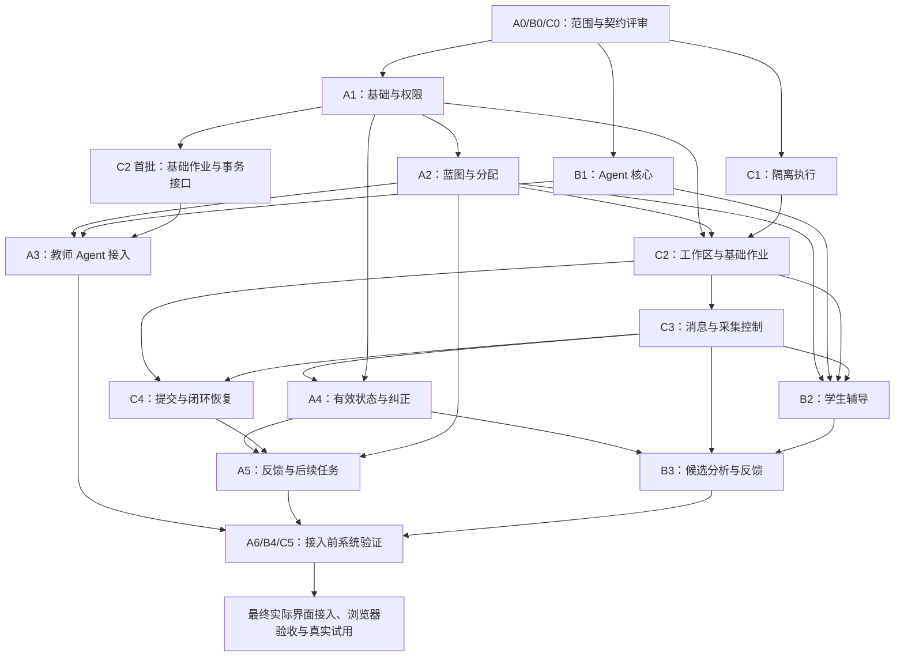

# XunJie 三人开发分工与交付顺序

版本：0.3 · G0 负责人统一裁决：2026-10-09（Asia/Shanghai）

状态：G0 的活动、技术契约和分段实施方案已获负责人统一批准，五份基线已同步/验证/推送，#1 已关闭并通过准备门禁。仓库无正式应用代码，环境/业务/浏览器验收未执行，不记为 A/B/C 逐人签认。

依据：[工作规范](../../AGENTS.md) → [PRD](../product/PRD.md) → [MVP_SPEC](../product/MVP_SPEC.md) → [TECH_DESIGN](../product/TECH_DESIGN.md)。复用时另读[工程衔接说明](../reference/ENGINEERING_HANDOFF.md)与[产品研究依据](../reference/PRODUCT_RESEARCH.md)。

## 1. 这份文件怎样使用

本文件给三名成员分配后台、Agent、工作区与执行任务，明确谁先交付、谁可以并行、谁必须等待。按任务编号领取工作；用交付物和检查结果判断完成，不用聊天中的“差不多了”代替交接。

- 原有需求、权限、数据模型、限额与验收编号保持有效。本文件安排实施，不替代规格，不将推荐技术当作已批准选型。
- “可开始开发”表示已有足够规格，可以写本模块代码和隔离测试；“可联调”表示所依赖的真实模块已交付；“验收通过”必须有实际执行结果。这三种状态分别记录。
- A/B/C 之间可以并行；同一个人按个人任务顺序推进，不把一个人的多项任务算作多人并行。上游未完成时，可以做不依赖它的任务或基于契约的测试。
- 样例数据和测试替身仅用于隔离工程测试，不进入真实学生记录，不计作模型接入、消息展示、执行隔离或完整流程通过。
- 原 G1～G3 的服务端部分先预交付，实际界面接入统一放在最后。原切片的浏览器与完整流程完成条件仍保留，不能把预交付记为整个切片验收通过。
- G0 方案和首批进入条件已获项目负责人确认；本工作项仅交付文档/必要检查。进入具体编码前建对应任务文档并核上游条件，实际建表/迁移、删除、凭据/CI 和生产发布仍按 AGENTS 单独授权。

## 2. 固定职责与修改边界

| 成员 | 主责模块 | 独立负责的产物 | 不能代替的责任 |
| --- | --- | --- | --- |
| A：业务后端与教师闭环 | access、design、review；应用基础与公共契约汇总 | 认证授权、课程资料、蓝图/活动/分配、学习状态与教师决定、后续任务、业务事务 | 不包办 Agent 提示/分析，不自行改执行配置，不把模型候选直接写成教师正式判断 |
| B：教学 Agent 与学习分析 | tutoring；教师生成与候选分析的模型逻辑 | 模型适配、教师草案/局部建议、学生辅导、上下文与检索、输出校验、候选分析、反馈草稿 | 不写学生作品、不调用学生运行、不发布活动、不造原始证据、不作正式评价 |
| C：学生工作区与执行保障 | workspace、records、runner | 尝试/文件/快照、运行/检查/提交、消息/回执/覆盖区间、持久作业、导出、备份与恢复 | 不改教师教学决定，不从日志猜测掌握，不用应用宿主直接执行学生代码 |

A 兼任集成协调人：汇总接口和验收、安排共享文件修改、追踪阻塞。每人负责自己模块的实现、测试、文档和故障修复，协调人不替成员补完未交付模块。

### 2.1 共享内容怎样分配

| 共享内容 | 维护责任 | 协作方式 |
| --- | --- | --- |
| 公共接口字段、状态、错误码、版本约束 | A 汇总；B/C 提供自己模块的契约 | 先在 TECH_DESIGN 更新契约，再同步实现和调用方；不单方面变更字段 |
| 应用启动、认证、业务数据库核心和事务入口 | A | B/C 通过既有模块接口接入；数据库结构由各领域提出、A 汇总评审，实际变更另行授权 |
| 作业、命令回执、审计、事件通知与原始记录 | C | A/B 使用同一套基础能力；不各自再建队列、事件表或回执实现 |
| 当前有效学习状态、主张 revision、教师决定 | A | B 提交有引用的候选；C 提供原始依据；有效投影与纠正事务归 A |
| 模型、提示、策略与分析版本 | B | 版本和用量进入 C 的记录能力；凭据不进入业务记录、日志或测试样例 |
| 尝试生命周期、作品与提交快照 | C | A 的分配/复核与 B 的辅导调用 C 的受约束接口，不直接改学生文件 |
| decisionEpoch 与旧动作失效 | A/B/C 按触发原因协作 | C 提供支持同一数据库事务的增 epoch/失效操作；A 用于教师纠正/分配控制，B 用于辅导替换；不得拆成跨服务双写 |
| README、规格和进度记录 | 各人维护本人任务稿/README，A 汇总差异，受保护基线由获授权维护者写入 | 每项交付包含任务记录，基线写入须文件/范围授权；计划、实现、验证分别写明 |

目录/精确依赖/文件责任按已批准 TECH 第 2/3.1 节：A 管 apps/teaching 的入口/公共定义/业务 tx 和 access/design/review；B 管 tutoring；C 管 workspace/records/runner，A 汇总 package/锁文件等共享需求。仍无正式源码，模块名不代表已实现，不另拆微服务或 UI 工程。

## 3. 总顺序与并行方式

| 执行段 | A 的优先任务 | B 的优先任务 | C 的优先任务 | 本段交付 |
| --- | --- | --- | --- | --- |
| P0：G0 范围和契约 | A0 业务/权限/公共契约 | B0 模型/教学契约 | C0 工作区/记录/执行契约 | 三人契约可衔接，决策和授权缺口明确 |
| P1：G1 服务端作品链 | A1 基础与权限 → A2 蓝图/版本/分配 | B1 Agent 核心与模型适配 | C1 隔离执行 → C2 工作区/快照/基础作业 | 真实服务端可完成进入、保存、运行和检查 |
| P2：G2 服务端教学支持 | A3 教师 Agent 业务接入 | B2 真实上下文与学生辅导 | C3 教学消息/回执/采集控制 | 教师起草与学生求助链路接通，记录可追溯 |
| P3：G3 服务端反馈闭环 | A4 有效状态/纠正 → A5 反馈/后续任务 | B3 候选分析与反馈草稿 | C4 提交/重开/闭环恢复 | 提交、分析、复核、纠正和后续任务贯通 |
| P4：接入前系统验证 | A6 权限/事务/业务链汇总 | B4 教学语义/延迟/成本验证 | C5 隔离/故障/导出/备份/性能验证 | 服务端交接包和实际验证记录齐备 |
| P5：最终接入与 G4 试用 | 见第 9 节 | 见第 9 节 | 见第 9 节 | 完成实际界面验收，再进行真实试用 |

P1～P4 是工作排程，不能当作新增产品完成标准。提前开展某项核心逻辑或隔离测试，不意味着它所在阶段已经完成。

### 3.1 关键依赖图

实线表示真实联调的主要交付依赖；阶段归并与完整验收条件另见各节。A0/B0/C0 起草可以并行，不互相等待；同一任务分批交付时，下游只等待它需要的那一批，不等整张任务卡完成。

C1 的真实执行条件受课程语言和环境授权约束；C2 的契约开发可以提前，其完整运行链联调才等待 C1。B3 无候选时 A5 仍须支持人工复核，不把模型可用性变成保存或教师操作的前提。

## 4. P0：三人先并行确定范围和交付契约

### A0：业务范围、权限与公共契约

- **依据：** PRD 第 5、8、9 节；MVP_SPEC 第 2、4、8 节；TECH_DESIGN 第 4、5、7、9 节。
- **工作：** 整理教师/学生/维护者的真实权限；明确课程成员、材料可见性、活动/尝试状态；汇总公共 ID、版本、错误码、幂等和事务约束；形成业务数据结构与授权事项清单。
- **交付：** 公共契约正文、角色/资源授权矩阵、业务状态表、尚待确认参数；引用更新后的 TECH_DESIGN，不另造一份冲突规格。
- **依赖：** 可立即按基线起草；最终评审吸收 B0/C0，不先要求它们交代码。
- **通过条件：** 每个业务命令有发起角色、归属范围、允许状态、版本/幂等要求；A/B/C 对跨模块字段含义一致。

### B0：模型、帮助与分析契约

- **依据：** M-01、M-04、M-06、M-07；TECH_DESIGN 第 6 节；产品研究中的三条能力线和证据边界。
- **工作：** 明确教师生成/学生辅导/候选分析各自输入输出；提出模型、数据处理与预算方案；定义引用、帮助条件、未知、修复/取消/超时与成本记录格式。
- **交付：** 模型接入待决策项、教学输出与候选结构、固定合成工程样例和预期边界；不包含真实学生数据或凭据。
- **依赖：** 与 A0/C0 并行起草；最终上下文和事件引用与两人契约对齐。
- **通过条件：** 每类输入有获准范围，每类输出有校验与保存归属；模型不能越权执行作品操作或正式教学决定。

### C0：工作区、记录和执行契约

- **依据：** M-03、M-05、M-07、M-09、M-10；TECH_DESIGN 第 4.1、7、8、10 节；工程衔接说明。
- **工作：** 明确确认快照/ObjectRef、同步 ACK/冲突、作业/回执/覆盖区间、运行与检查结果；确认独立节点条件和首发语言；设计可供教师纠正事务调用的失效能力。
- **交付：** 工作区/执行/记录接口、环境与限额验证方案、基础作业/事务协作契约、恢复与导出约定。
- **依赖：** 与 A0/B0 并行；语言与课程检查规则须由课程负责人确认后才能冻结运行配置。
- **通过条件：** 所有运行/提交绑定不可变快照；原始事实、模型候选、教师决定分开；明确不能在应用宿主运行学生代码。

### G0 决策及进入实现的门槛

| 事项 | 准备负责人 | 决定者/进入相关工作的条件 |
| --- | --- | --- |
| D-01：课程、项目、先备、语言与规则 | A 汇总，B/C 核教学/执行 | C 程序设计/C、函数/数组/指针先备、Web Core→反馈→Report、目标/帮助与行为已统一批准；实际蓝图/教材段落教师审阅，C1 就绪后才开放 |
| D-02：主模型、数据与调用控制 | B 主责，A/C 配合 | DeepSeek/deepseek-flash 及 TECH 配置已批，无文档预算金额；真实 API/账号/数据核查、凭据/付费操作在相应验证前落实 |
| D-03：账号、网络、访问、复核与备份 | A 主责，C 配合 | 预置账号/私有访问/90 天复核不自动删除/责任与恢复方案已批；实际入口/告知/节点/备份位置和真人数据条件按 TECH 门禁 |
| 后台选型、目录、接口与共享责任 | A 汇总 B/C 输入 | 负责人统一裁决采纳，正式契约在 TECH；实际安装/驱动/原子性等验证未执行，不能把各成员写成已签名 |
| D-04：实施分工、交付依赖与验收组织 | A 汇总 | 沿用既定职责、任务依赖与第 8 节验收主责，不登记 A/B/C 实际投入时间或首批交付日期 |
| 大规模实施及各项红线操作 | 各操作负责人提出具体方案 | 项目总负责人按 AGENTS.md 确认；文件建立不等于上述操作已授权 |

某项条件未具备时，只阻塞依赖它的工作。记录缺口、负责人、正在等待的决定，以及可继续的任务；不能用假结果填补缺口。

### 4.1 整体 G0 统筹与冻结记录

启动日期：2026-10-08（Asia/Shanghai）。G0 统筹范围包括教学范围、技术与公共契约、模型与数据预算、资源条件、交付依赖和授权门禁。

2026-10-09，项目负责人取消 A/B/C 实际投入时间和首批交付日期的登记要求，并授权同步本计划。按既定分工和真实依赖推进阶段交付，验收责任保留；本次取消要求不批准其他待评审契约、资源条件或具体实施。授权与核对记录见 [G0 任务记录](../tasks/G0_SCOPE_CONTRACT_GATE_REVIEW.md#10-2026-10-09-授权与直接交付记录)。

当前状态：**G0 范围、共享契约和分段实施方案已由负责人统一裁决，基线同步/检查/推送完成，#1 已关闭**。A0/B0/C0 的 PR #5/#8/#6 已合入，逐项静态核对/分歧收敛和首批方案由负责人批准；裁决角色及五份文件授权见 [G0 裁决记录](../tasks/G0_CLOSURE_PROPOSAL.md#10-2026-10-09-负责人统一裁决及基线同步)。这是真实负责人决定，不补造三人的签认或环境就绪。历史准备过程保存在任务稿，以下为当前进入条件。

#### 本轮目标与各角色产物

G0 要回答四个实际问题：首版教什么、三人的契约能否衔接、实现依赖是否具备、哪些工作获准开始。整体统筹同时推进决策和契约，不把整个阶段变成某一成员的专项，也不要求总负责人先独自选完所有参数。

| 责任角色 | 本轮具体产物 | 交给谁核对 |
| --- | --- | --- |
| 总负责人组织课程负责人 | D-01 教学范围决定：课程/先备、唯一语言、主项目及后续任务、三条能力线目标、路线空间、帮助政策与课程检查规则；汇总并裁决范围/资源/交付依赖分歧 | A 核对业务可表达，B 核对帮助与分析，C 核对执行与检查；教学内容仍须课程负责人确认 |
| A：A0 | 角色/资源授权矩阵；业务状态表；逐命令的发起者、归属、允许状态、版本/幂等/错误约束；后台选型及目录/共享文件责任评审稿；D-03 账号与数据管理方案 | B/C 核对调用和事务边界；总负责人审阅技术方案及待决定项 |
| B：B0 | 教师生成/学生辅导/候选分析三类输入输出与资料可见范围；引用、帮助条件、未知、取消/修复/超时/用量契约；模型/数据处理/预算提案；合成工程样例与预期边界 | A 核对权限和候选保存归属，C 核对对象/作业/消息/引用；产品/技术负责人决定 D-02 |
| C：C0 | 快照/ObjectRef、同步 ACK/冲突、作业/回执/覆盖区间、运行/检查/提交契约；同事务失效接口；独立节点条件及安全限额验证方案；恢复/导出/备份约定 | A 核对权限、事务和复核依赖，B 核对上下文与动作记录；教学/技术负责人决定相关资源条件 |
| A 汇总，总负责人组织会审 | 统一的契约差异与决定记录、相关条件未具备时的受阻任务、P1 首批交付顺序和实施/验证方案 | A/B/C 会审，总负责人确认实施范围；红线操作按具体方案另行授权 |

A0/B0/C0 的契约正文更新在 TECH_DESIGN 对应章节，验收语义沿用 MVP_SPEC；本节只登记统筹与决定，不另造一套业务规格。每份评审产物写清：对应章节与 M/AC/NFR、输入输出及拒绝/失败边界、依赖的待定参数、验证方式、需要其他成员确认的事项。

#### 推进顺序与等待关系

1. **并行起草：** A0/B0/C0 按现有基线准备各自产物；未定语言、供应商和资源作为显式参数缺口。通用权限、版本、对象、记录与取消契约可以先评审，不要求课程或模型全定后才开始。
2. **并行准备决策：** 总负责人组织 D-01 课程选择；B 准备 D-02 模型与预算方案；A/C 准备 D-03 账号、数据与资源方案。课程/语言优先收敛，因为运行镜像、课程检查规则和教学样例依赖它；模型方案与资源核查同时推进。
3. **集中会审：** 按下表核对三人交界处；不一致先修改 TECH_DESIGN。涉及用户结果、权利或核心流程变化时先更新 PRD/MVP，由总负责人处理范围决定。
4. **冻结与分派：** 将决定、未具备条件的责任/触发时点和受阻任务写入本节；A 汇总实际目录、共享责任和首批实施方案，按任务依赖确定交付顺序，由项目总负责人确认具体大规模实施范围。

| 会审交界处 | 必须共同确认的结果 | 牵头与配合 |
| --- | --- | --- |
| 身份与版本 | 会话身份/课程归属不能由请求参数伪造；活动/尝试固定版本；snapshotId/fileId/hash/范围可核对 | A 牵头，C 提供对象和快照约束，B 确认读取范围 |
| 作业、消息与取消 | Job/CommandReceipt/事件共用 C 的能力；生成/投递/展示/确认分开；epoch/revision/对象过期、取消、重试的行为一致 | C 牵头，A/B 确认调用与失效触发 |
| 原始事实、候选与教师决定 | C 提供可追溯原始引用；B 只产候选；A 管有效状态和教师判断；纠正与旧依赖失效在同一事务完成 | A 牵头，B/C 核对输入、保存归属和事务接口 |
| 运行与可信检查 | 学生显式发起；运行、课程检查与正式评价分开；独立执行边界、限额和失败分类可验；私有资产不进入学生/辅导载荷 | C 牵头，A 核对权限与活动就绪条件，B 核对允许读取的诊断 |
| 恢复、覆盖与导出 | ACK 后成果可恢复；无回执/结果未知如实表达；采集空窗不回填；导出按角色裁剪且引用完整 | C 牵头，A/B 核对状态、角色与有效历史 |

#### 当前决策队列

下表已由负责人统一批准；未具备的实际条件明确责任/触发/受阻工作，并保留对应红线和验收。

| 事项 | 已有评审起点与待决定内容 | 准备/决定责任 | 当前状态及受阻工作 |
| --- | --- | --- | --- |
| D-01 教学范围 | C 程序设计/C，Web Core→反馈→Report，函数/数组/指针先备，三能力线/帮助与 TS 行为见 MVP | 教师/A 实际内容；C1 profile，B 教学支持 | 范围已批；获准资料/蓝图和实际运行就绪由教师/A/C 在活动开放前落实 |
| D-02 模型/数据 | DeepSeek/deepseek-flash、显式非思考/结构化校验、16K/4096 token、最多 3 次/45 秒、配额/usage，预算金额不入文档 | B 主责，教学/技术负责人定实际数据告知 | 配置已批；实际账号/API/数据/付费与凭据授权未具备前仅合成，B4 实测/语义后置 |
| D-03 账号/数据/资源 | 预置账号/私有访问、8h/30m 会话、90 天复核/无自动删除、A/C 节点/一致性备份/RPO/RTO | A/C 落实，教师处理异议，技术/教学负责人确认实网与数据 | 方案已批；C1 节点/镜像/隔离前不运行，A1 实存储操作另授权，C5 恢复与真人条件后置 |
| 后台技术与共享责任 | TECH 第 2～8 节完整命令/字段/权限/事务/取消/恢复/产物与第 3.1 节精确版本 | A 汇总共享文件，B/C 按所属模块实现 | 已统一裁决并合入；实际兼容/权限/失败注入与隔离未执行，后续任务核调用接缝 |
| D-04 实施分工、交付依赖与验收组织 | 沿用本计划的 A/B/C/UI 职责、任务顺序、并行/等待和验收主责 | A 汇总；总负责人协调 | 2026-10-09 已确认取消投入/日期登记要求；按真实依赖推进，其他 G0 门禁保留 |
| 实施授权 | A1-P1 工程/入口、B1 合成核心、C2 首批快照/公共记录/tx 核心方案及进入条件已批 | 各主责进入前建立本人任务稿、核已具备条件 | 本 G0 不编码；数据库/凭据/付费/真实数据/节点操作/CI/删除/生产发布另授权，真实联调等对应上游 |

#### G0 退出核对与下一阶段入口

本清单应用第 4 节与 MVP_SPEC 第 8 节的既有门槛，不增加产品范围，也不替代工程验收。

| 核对项 | 当前结论 |
| --- | --- |
| 三份产品文档审阅、教学范围与 UI 业务接入边界 | 负责人统一批准；Core/Report、实际学生空间、先备/目标/帮助与正文已同步，UI 最后接入 |
| A0/B0/C0 可衔接，后台选型、目录与共享责任 | 交付 PR、15 项差异收敛和正式 TECH 契约已有来源，负责人统一裁决；不记逐人签字或实际业务通过 |
| 模型、数据与资源条件可执行 | 准备方案/责任/触发/受阻任务已明确并批准；实际环境、数据核验与真人入口后置门禁保留 |
| 交付顺序与验收组织可执行 | 任务依赖与验收主责沿用本计划；投入时间/交付日期的登记要求已取消 |
| 具体首批实施方案获项目总负责人确认 | A1-P1/B1/C2 首批范围与进入条件已批；本项只完成 G0，未实施应用或授权红线操作 |

G0 评审收敛后，首批实现沿用 P1：A 推进 A1 基础权限，B 推进 B1 Agent 核心，C 在语言/资源及相关授权具备时优先验证 C1 执行可行性；资源未具备时 C 仅推进已获准且不依赖环境的契约或隔离测试。A1/A2/C1/C2 的后续真实联调依赖保持第 5 节原约定。模型、试点和红线条件仍按各自触发时点执行，不能用替身或占位就绪结果替代。

任务跟踪见 [G0 Issue 跟踪](G0_ISSUES.md)：[总 Issue #1](https://github.com/paher-din/XunJie/issues/1) 跟踪共同决策与会审，[A0 #2](https://github.com/paher-din/XunJie/issues/2)、[B0 #3](https://github.com/paher-din/XunJie/issues/3)、[C0 #4](https://github.com/paher-din/XunJie/issues/4) 跟踪各自交付，四项已发布并双向关联。Issue 关联交付 PR 与评审记录，业务契约仍维护在 TECH_DESIGN，进展同步 MVP_SPEC 第 10 节；创建任务不改变交付或验收状态。

## 5. P1：并行建设服务端作品链和 Agent 核心

### A1：应用基础与真实权限

- **实施范围：** 服务入口、公共校验/错误、认证会话、课程成员和资源归属校验、CSRF/Origin 与登录限流、批准后的数据库初始化与短事务能力。读接口、导出、事件和模型读取复用授权规则。
- **开工/联调：** G0 契约与相关实施授权到位后开始；不等待 B/C 业务实现。
- **交付：** 可重复启动的服务、真实登录/授权接口、供 B/C 使用的权限和事务入口、启动/测试说明。
- **验证：** 未登录、伪造 role/studentId、跨学生/课程、非任课教师、重复/冲突请求；日志不暴露正文或凭据。覆盖 AC-02 的基础权限部分及 NFR-04。
- **交接：** C2 使用权限/事务；A2/A4 复用基础；B 的读取工具只接获准接口。

### A2：教师业务与活动版本

- **实施范围：** TXT/Markdown/粘贴材料和段落版本、蓝图直接编辑/版本冲突、目标与量规关联检查、三类检查结果、三种角色投影、活动不可变版本、分配与暂停。
- **开工/联调：** 契约开发可提前；真实权限接 A1。可以先创建/修改草稿；允许确认开放的活动必须等待 C1 的真实运行配置就绪，不能伪造 ready。
- **交付：** 先交材料/草稿/编辑/投影接口，供 A3 接教师起草；再交确认/分配/暂停。运行环境未就绪不阻碍草稿起草，但阻止开放活动。
- **验证：** 人工改动不被覆盖；旧 revision 写入冲突；活动不能原地改；私有答案不在学生/辅导载荷中；越权分配被拒。覆盖 AC-01/02 的确定性业务部分。
- **交接：** B1/B2 读取获准资料和政策；C2 校验分配并创建尝试；A3 接教师生成。

### B1：教师生成和学生辅导的独立核心

- **实施范围：** 模型适配、1–3 个项目候选、蓝图草案和局部建议；无历史也可工作的学生辅导核心；结构/引用/政策校验、有限读取、取消/超时/修复和用量记录。
- **开工/联调：** B0 后可使用合成工程样例和测试替身编码，不等待业务服务；真实模型验证必须等 D-02 与所需接入条件获准。
- **交付：** A3 可调用的教师生成能力、B2 可复用的辅导核心、工程样例与实际模型验证记录；替身结果单列。
- **验证：** 无历史、缺上下文、请求整份答案、资料指令注入、格式失败、取消与模型中断。单轮 ≤3 次模型调用、含排队总等待 ≤45 秒；语义质量保留人工审阅。
- **交接：** A3 消费教师建议；B2 接真实对象；配置与用量通过 C 的记录接口保存。

### C1：隔离执行与可信检查，优先验证可行性

- **实施范围：** 独立 Linux 节点/VM、批准语言和固定镜像/命令、非 root/无网络/受限挂载、路径与文件清单校验、资源/输出/时间限额、整个隔离单元取消、可信验证器和结果来源。
- **开工/联调：** 首发语言、环境和相关操作授权就绪后，可先用合成固定快照验证，不等待应用权限或模型。随后接 C2 的真实作业。
- **交付：** 固定 runId 的提交/查询/取消接口、环境版本和真实就绪结果、RunRecord/CheckResult、失败分类和安全验证记录。
- **验证：** AC-10、AC-15 的执行/验证器部分；落实 NFR-03 的全部限额。拒绝路径逃逸、网络/他人数据/应用密钥访问、任意命令和伪造 passed 输出。
- **交接：** A2 检查真实运行配置；C2 调用执行器；B 只能读政策允许的诊断。环境缺失阻止真人执行，不回退到应用宿主。

### C2：工作区、快照、运行和基础作业

- **实施范围：** Attempt、路线/返回位置、学生文件新建/回收、同步去重与乐观冲突、落盘后 ACK、不可变多文件快照、运行/检查、基本恢复；先提供通用 Job/CommandReceipt/事件和同事务失效基础。
- **开工/联调：** 按 C0 可先编码；真实多用户联调等待 A1，真实尝试等待 A2 分配，真实执行等待 C1。基础作业须可被 A3 使用，不拖到 C3 才第一次提供。
- **交付：** 先交公共作业/事务接口给 A3，再交同步/快照/ObjectRef/恢复接口，最后完成真实运行/检查链；提供已确认/未确认/冲突可辨的结果与模块测试。
- **验证：** 重复同步、基版本冲突、回收后同名重建、固定旧快照运行、限额、重启不丢 ACK 成果、运行结果未知不盲目重跑。覆盖 AC-03/04/06/12 的服务端部分。
- **交接：** A3 使用作业；B2 读取快照和结果；C3 复用记录；C4 固定提交；所有接口继续使用 A1 的归属授权。

### P1 服务端预交付条件

用新建隔离测试账号与项目，通过真实服务端接口完成：教师草稿编辑/确认/分配 → 学生创建尝试 → 文件同步/确认 → 固定快照运行/课程检查。权限、版本和执行拒绝用例同时执行。A1/A2/C1/C2 的模块接口齐备；B1 可独立交付，不要求教学链此时已全部接入。

记录具体通过的用例与未执行项；AC-03/04 等涉及实际界面的部分仍待最终接入，不能记整个 AC 或 G1 已验收。

## 6. P2：接通教师 Agent 与学生辅导

### A3：教师 Agent 的业务接入

- **实施范围：** 起草/局部建议的异步命令、提案与基础 revision、字段差异/影响项/引用、教师采用时的正式 PATCH、样例试评量规与歧义修订记录。
- **依赖：** A2 首批草稿接口＋B1＋C2 首批基础作业；不等待 C1 运行环境、A2 活动开放、C2 完整运行链、B2 学生辅导或 C3 教学回执全部完成。
- **交付/验证：** 教师材料到候选/蓝图/局部建议的真实接口链；AI 不能覆盖期间人工编辑、不能自动确认活动。完成 AC-01 确定性部分，内容由真实教师另行审阅。

### B2：真实上下文、学生辅导与控制权

- **实施范围：** help 命令、ObjectRef 核验、获准课程段落与当前结果、相关有效状态与反证；有限动作、帮助政策、限定检查、无历史降级、过时对象/epoch 检查、停止与新求助取代旧求助、可选提醒默认关闭。
- **依赖：** B1＋A2 的版本/政策＋C2 的快照/结果；事件/输出持久化和完整取消投递接 C3。学习状态尚无时按空状态工作，不能阻止求助。
- **交付/验证：** 获准且可追溯的教学动作；不自动改代码/运行；普通帮助符合政策；关闭提醒取消待投递提醒但主动求助继续可用。覆盖 AC-04/05/15/16 的服务端与策略部分。

### C3：消息、回执、过程记录与作业失效

- **实施范围：** 学生问题和实际教学原文、生成/投递/展示/确认分离、回执版本与去重、获准内容事件与游标补取；采集暂停/恢复、功能数据例外、覆盖空窗、停止被动分析；完成通用取消和同事务失效调用。
- **依赖：** C2；可以依据 B0 的动作契约先实现，不必等 B2 真正产出消息后才开工。
- **交付/验证：** 消息/回执/采集/事件接口、A4 可在纠正事务中调用的失效能力。重复请求/回执不重复动作；缺回执保持未知；暂停不上传逐次编辑、不补造空窗。覆盖 AC-06/07/08/11/12 的服务端部分。

### P2 的并行和交接

A3 的教师链与 B2/C3 的学生链分别推进。B2、C3 按契约并行开发，真实投递联调等双方交付；收到或展示回执的测试客户端只能标为工程样例，不证明实际学生已看到内容。

服务端预交付需能完成教师真实生成/局部采用和学生真实求助/取消；内容、政策、版本、引用、作业和回执可回查。消息展示、停止交互、例子返回和采集开关的实际界面检查留到最后。

## 7. P3：完成分析、教师复核和后续任务闭环

### A4：有效学习状态、异议与纠正事务

- **实施范围：** 自述与候选/教师判断分层、主张范围/依据/帮助/未知、版本化有效投影、学生异议、教师确认/纠正/暂缓、expectedStateRevision；纠正与 epoch/作业失效同一短事务保存。
- **依赖：** 契约与 A1 后即可开发状态逻辑；真实纠正联调依赖 C3。可用明确标记的候选工程样例测试，不等待 B3 模型提取完成。
- **交付/验证：** B 可读取/提交候选的受控接口、教师决定/有效状态/异议接口、并发纠正测试。旧复核被拒，撤回依据不恢复，旧候选/已显示帮助保留真实历史。覆盖 AC-07/08。

### B3：有依据的候选分析与反馈草稿

- **实施范围：** 在获准低频节点提取三条能力线候选，区分作品结果、帮助条件、反证和未知；记录输入引用及分析版本，输出反馈草稿；无关/撤回历史不进入后续支持。
- **依赖：** B2 的辅导语义、C2/C3 的实际引用和覆盖、A4 的状态接口；契约样例可先开发，真实输入链等各模块交付。
- **交付/验证：** 带原始引用的候选和反馈；旧 revision 分析不能写入新状态，采集暂停不排被动分析，工具故障不算知识错，不用多次运行累积掌握率。覆盖 AC-07/08/16。

### C4：提交、修订与闭环恢复

- **实施范围：** 固定作品快照提交、课程检查引用和反思、旧提交保留、教师允许后学生主动重开、恢复活动/作品/运行/问题/返回位置；接通教师纠正失效与迟到结果处理。
- **依赖：** C2/C3 后即可开发提交和恢复；教师许可、状态纠正和后续链联调依赖 A4/A5 对应契约与接口。
- **交付/验证：** 先交固定提交/查询/恢复接口给 A5；重开许可与 A5 按已约定契约各自开发后联合验收，不能互等整个任务完成。保留不可改写的历史引用；重试不重复提交，恢复不替学生改变状态，应用/执行器掉线结果未知可辨。覆盖 AC-06/08/09/12。

### A5：教师反馈、个人修订与后续活动

- **实施范围：** 分别呈现作品表现、三条能力线、帮助和未知；教师保存正式反馈、允许修订、复制蓝图创建新活动/相关后续任务；新尝试读取适用课程与目标的有效状态。
- **依赖：** A2＋A4＋C4 首批提交/恢复接口；重开许可与 C4 联合接通，不以对方整任务完成作为开工前提。B3 提供可选反馈草稿；模型不可用时仍可人工复核/反馈。
- **交付/验证：** 从旧提交/教师决定到修订或新任务的真实服务端链；旧活动/量规不静默变更，旧错误不再为新辅导依据，无迁移证据保持未知。覆盖 AC-08/09/16。

### P3 联调顺序与退出条件

1. C4 固定提交，C2/C3 提供实际引用。
2. B3 生成候选，通过 A4 的引用/版本校验保存；缺数据时保留未知。
3. A4 接受教师账号的复核命令，同事务更新有效状态并调用 C3 失效能力。
4. A5 保存反馈/新活动或允许修订，C4 保留旧提交并支持学生主动继续。
5. 新求助通过 B2 读取最新有效状态；旧生成/分析完成后也不能恢复已撤回主张。

三人分别编写模块测试，再用真实服务端和隔离样例完成整条链。记录“服务端闭环通过”，不表述为真人教师/学生试用或浏览器端到端通过。

## 8. P4：接入前验证、验收责任与交接包

### 8.1 三人的收尾任务

| 任务 | 负责人 | 必须完成的交付 |
| --- | --- | --- |
| A6：业务与事务验证 | A | 权限/角色投影/活动版本/教师纠正/后续任务的真实集成测试；协调接口缺口与共享文件；汇总 AC/NFR 通过、失败、未执行项；整理业务操作与测试账号准备方法 |
| B4：模型与语义验证 | B | 固定样例与真实模型检查分别报告；教师草案/帮助/历史/候选的人工语义审阅；取消/超时/预算降级；延迟、调用次数、已知/未知用量和费用记录 |
| C5：系统与恢复验证 | C | 专用环境安全验收、限额与固定快照检查、掉线/重启/迟到事件/重复请求演练；课程/个人授权导出；一致性备份和恢复引用完整性；运行与保存负载记录、恢复说明 |

三项可以并行，最终汇总要等所有需要的模块真实交付。各人修复自己模块的问题；跨模块问题指定一位主责，其他成员配合，不能都写“等联调”。

### A6：权限、事务和业务链的验证交付

- **依赖：** A1～A5 与所需 B/C 接口真实交付；可以先执行已具备部分，不等待模型语义全部审阅。
- **工作：** 核对所有读写/事件/导出/模型读取的课程归属；执行蓝图冲突、不可变版本、教师纠正并发、活动暂停和后续任务回归；汇总跨模块验收和恢复声明。
- **交付：** 业务链验证报告、每个 AC/NFR 的状态及证据链接、最终接入的接口/操作清单；实际启动与测试方法同步 README。
- **通过条件：** 没有未处理的严重越权、旧版本覆盖或纠正失效；依赖与未执行项可追踪。个人代码通过不等于整个产品完成。

### B4：教学语义、模型边界和调用表现的验证交付

- **依赖：** B1～B3 与真实模型条件、A4 有效状态及 C 的记录已具备；人工语义审阅需实际审阅者，不以模型自评代替。
- **工作：** 检查草案与量规关联、提示适切和学生接棒、相关/无关/撤回历史、未知与反证、受限帮助、取消/超时/格式修复/预算耗尽；按规定样本量测延迟和用量。
- **交付：** 固定样例结果、真实模型与人工审阅记录、成功/失败/超时、配置版本、成本与缺失用量说明；替身与实际模型分开统计。
- **通过条件：** 确定性权限/引用/版本拒绝通过；严重语义错误已处理；实测不达目标时明确瓶颈和待办，不只提供成功回答或关键字匹配结论。

### C5：隔离、故障、导出和恢复的验证交付

- **依赖：** C1～C4 与 A/B 的真实状态/动作记录具备，专用执行环境及备份操作条件已准备；可以先测独立运行和同步部分。
- **工作：** 执行安全/限额测试、作业重复/取消/迟到/结果未知检查、应用与执行器重启/断线演练；完成授权课程/个人导出，检验一致性备份后的引用和成果；登记环境做负载测量。
- **交付：** 运行隔离证据、同步/作业/覆盖/导出检查结果、RPO/RTO 与实际恢复记录、资源和保存性能数据、维护与恢复说明。
- **通过条件：** 不暴露应用/他人数据；ACK 成果重启不丢；备份恢复满足所声明 RPO、原始引用完整；未知结果不冒充成功、不静默重复执行。实际删除或其他红线操作另行授权。

### 8.2 M-01～M-10 的实现覆盖

| 首版能力 | 主要实现任务 | 主责与协作 |
| --- | --- | --- |
| M-01 教师共同设计 | A2、A3、B1 | A 管业务与人工修改，B 管生成和建议 |
| M-02 检查、角色预览、分配版本 | A1、A2、C1 | A 主责；C 提供真实运行配置就绪依据 |
| M-03 学生工作区 | C2 | C 主责服务端与版本语义；实际操作最后接入 |
| M-04 就地帮助与接棒 | B2、C3 | B 管帮助和政策，C 管记录/回执/取消基础 |
| M-05 消息、记录、覆盖 | C2、C3 | C 主责；B 尊重采集开关和引用边界 |
| M-06 可纠正学习状态 | A4、B3、C3 | A 管有效状态，B 管候选，C 提供原始引用/覆盖 |
| M-07 提交、检查、反馈 | C1、C4、A5、B3 | C 管提交/可信检查，A 管正式反馈，B 起草 |
| M-08 教师复核与教学行动 | A4、A5、B3、C3 | A 主责；B/C 配合纠正传播 |
| M-09 后续任务与恢复 | A5、C4、B2 | A 管后续活动，C 管作品/尝试恢复，B 使用有效历史 |
| M-10 访问与运行保障 | A1、C1、C5 | A 管授权，C 管执行/导出/恢复；B 不持越权工具 |

### 8.3 AC-01～AC-16 的组织责任

完整验收内容以 MVP_SPEC 第 6 节为唯一清单。本表只分配主责，不能通过收窄测试入口、删除失败样例或改写判据来判通过。

| 验收 | 组织主责 | 配合 | 提前可完成与仍须等待的部分 |
| --- | --- | --- | --- |
| AC-01 教师草案与人工修改 | A | B | 版本/差异先测；实际操作与真实教师内容审阅最后补齐 |
| AC-02 私有资产与版本权限 | A | B、C | 服务端拒绝/投影/模型上下文先测；实际前端载荷最后核对 |
| AC-03 保存、刷新、多页冲突、回收 | C | A | 同步/冲突/历史先测；本机草稿与浏览器恢复最后测 |
| AC-04 运行/求助绑定旧快照 | C | B | 版本绑定/投递检查先测；当前编辑与提示定位最后测 |
| AC-05 帮助、停止、返回 | B | A、C | 政策/取消与语义先测；交互/返回实际操作最后测 |
| AC-06 重试、回执、重连 | C | A、B | 幂等/事件/回执接口先测；真实客户端回执/重连最后测 |
| AC-07 空历史、空窗、工具错、冲突 | B | A、C | 原始引用、候选和有效状态的跨模块测试先测；语义需人工审阅 |
| AC-08 并发纠正与旧生成 | A | B、C | 事务/epoch/旧结果先测；旧表单和展示竞态最后补齐 |
| AC-09 反馈进入后续任务 | A | B、C | 服务端链先测；实际操作与真实反馈最后复核 |
| AC-10 执行隔离和限额 | C | A | 专用隔离环境实测；未通过则阻止真人运行 |
| AC-11 采集暂停与恢复 | C | B | 存储/服务端开关先测；实际网络上传与界面说明最后测 |
| AC-12 中断、重启、掉线、恢复 | C | A、B | 服务端故障与备份演练先测；实际客户端恢复最后补齐 |
| AC-13 真实教师完整链路 | A | B、C | 最终接入后由真实教师操作，团队只组织/观察/修复 |
| AC-14 真实学生项目体验 | A | B、C | 最终接入后由真实学生操作，报告人数/总人数、退出与未知 |
| AC-15 限定帮助与可信验证 | C | A、B | 受限入口/命令/验证器先测；实际入口与结果区分最后补齐 |
| AC-16 相关/无关/撤回历史 | B | A、C | 固定工程样例及人工语义审阅先做，不能只靠关键字匹配 |

### 8.4 NFR 责任和测量口径

| 项目 | 主责 | 必须测量/记录 |
| --- | --- | --- |
| NFR-01 编辑与保存 | C，A 配合 | 服务端确认 p95 ≤1 秒、ACK 后重启不丢；本机状态与完整编辑体验最后验证 |
| NFR-02 辅导响应 | B，C 配合 | 接收/排队 ≤1 秒、非排队完整可展示结果 p95 目标 ≤20 秒、总等待 ≤45 秒；最终接入计入展示链 |
| NFR-03 运行限额 | C | 编译 30 秒、执行 10 秒；1 CPU、512 MiB、64 进程、128 MiB 临时空间、64 KiB 总输出；全局最多 2 个作业 |
| NFR-04 边界与可靠性 | A，B/C 配合 | 跨学生/课程、教师越权、私有资产、旧版本、重复副作用确定性用例全通过 |
| NFR-05 可用性与恢复 | C 汇总服务端准备 | 完整键盘、断网/重连、确认版与本机草稿、冲突不覆盖须待最后实际界面测试 |
| NFR-06 成本与观测 | B 管模型，C 管运行，A 汇总 | 用量/延迟/失败/重试/配置版本；未知不按零；预算耗尽仍可保存和人工复核 |

按 MVP_SPEC 原口径登记测试服务器、10 个活跃会话、每会话约 2 秒一次同步批次；保存/API 至少 100 次、模型求助至少 30 次，报告 p50/p95、错误与超时。接入前服务端数据只覆盖对应部分，不直接记全项达标。

### 8.5 每项交付的最小交接包

1. **代码与契约：** 实际仓库相对代码位置、适用规格/任务编号、请求/响应及状态说明、依赖版本；不用个人路径或旧实验服务作为入口。
2. **运行和调用：** 可重复的启动/调用/验证命令、环境条件与批准配置说明；凭据另行安全配置，不附在文档或样例中。
3. **证据：** 使用真实实现还是替身、用例/命令/结果、失败与未执行项；不只保存成功样例。
4. **交接：** 下游需要的接口、已有能力、限制、待办、阻塞的交付物和责任人；接口变更同步所有调用方。
5. **文档：** 同任务更新 MVP_SPEC 第 10 节；契约变化更新 TECH_DESIGN；启动/使用/验证变化更新 README。

P4 出口：三人服务端交接包齐备，无已知严重越权/数据丢失/隔离缺失，已完成部分有可重复验证结果；尚待实际界面的用例明确列为未执行。该出口表示可以接入，不表示正式应用工程完成。

## 9. P5：最后接入实际 UI，再完成 G4 真实试用

UI 成员只在本节加入分工。其页面、布局、控件和前端框架沿用实际交付；三人不提前替其设计或制作替代界面。

### I1：收到交付后进行接口与业务接入

- **前提：** A6/B4/C5 的接入包齐备；UI 成员交付可运行的实际工程、构建说明和已有操作。
- **A：** 汇总操作/接口对应表，接登录、蓝图、分配、复核与后续任务；核对角色裁剪与错误处理。
- **B：** 接教师建议与学生求助内容、政策和过时状态；核对帮助/停止/返回及分析表达。
- **C：** 接文件/快照/运行/检查/提交、保存与冲突、事件/回执、采集和恢复数据。
- **UI 成员：** 维护实际前端工程，完成数据接入、本机草稿、选区版本比对、实际展示回执、停止/返回、冲突恢复与键盘操作。
- **交付：** 可运行的完整应用、实际适配契约、明确缺口与解决结果。必要能力缺失时提出最小调整并协调，不能静默削减需求或另做一套 UI。

### I2：真实界面上的浏览器与全链路验收

按第 8 节主责逐项补齐待执行的实际界面检查；UI 成员修复前端问题，A/B/C 修复各自模块问题。重新核对投递前后版本、回执、账号切换本机草稿、保存/运行所用版本、停止/返回、采集暂停和限定帮助检查。

完整工程门槛仍为：M-01～M-10 在同一应用可用，AC-01～12/15～16 的确定性部分通过，人工内容审阅无严重未处理问题，NFR 有完整口径实测与失败说明。任何严重越权、丢失、执行隔离缺失或无法保存均阻止试点。

### I3：真实教师与学生使用

- **前提：** I2 通过工程门槛；D-01～D-03 的真实使用条件、预算与数据规则已明确。公开生产部署仍另行授权，不由本计划自动触发。
- **A：** 组织 AC-13/14，确认活动与账号准备，汇总教师准备/复核/纠错耗时和流程阻断。
- **B：** 协助真实教师审阅草案、实际帮助、候选与反馈，记录语义失败和模型费用，不替教师作教学判断。
- **C：** 保障执行/保存/恢复和证据导出，记录系统故障、覆盖缺口，不在后台替学生补学习状态。
- **UI 成员：** 处理实际交互问题，核对用户能找到项目、理解记录范围、停止帮助并返回作品。
- **真实用户：** 至少一位教师完成设计至再设计；建议 3–5 名学生参与，按 MVP 完成定义至少 3 名学生经正常界面完成流程；记录总人数、退出、中断与未知，不为满足验收捏造困难或教师纠正。

交付真实试用报告与下一轮问题清单。工程通过、流程可用与教学收益分别报告；不从小规模体验或固定样例推导教学有效性。

## 10. 任务状态、阻塞与变更记录

### 10.1 当前任务登记

G0 的交付 PR、静态核对和负责人统一裁决见第 4.1 节；正式共享契约已归入 TECH，原作者任务稿保留当时状态。各子 Issue 的最终交付/关闭记录由主责维护，不以本次统一裁决代签；代码阶段无交付，MVP §10 只登记真实文档/验证。

| 成员 | 个人优先顺序 | 当前状态 |
| --- | --- | --- |
| A | A0 → A1 → A2 → A3 → A4 → A5 → A6 | A0 [PR #5](https://github.com/paher-din/XunJie/pull/5) 已合入并纳入负责人统一裁决；[#2](https://github.com/paher-din/XunJie/issues/2) 作者状态待维护；A1-P1 可按门禁进入，其余无代码 |
| B | B0 → B1 → B2 → B3 → B4 | B0 修订 [PR #8](https://github.com/paher-din/XunJie/pull/8) 已合入并纳入统一裁决；[#3](https://github.com/paher-din/XunJie/issues/3) 作者状态待维护；B1 合成核心可按门禁进入，无实际模型/代码交付 |
| C | C0 → C1 → C2 → C3 → C4 → C5 | C0 [PR #6](https://github.com/paher-din/XunJie/pull/6) 已合入并纳入统一裁决；[#4](https://github.com/paher-din/XunJie/issues/4) 作者状态待维护；C2 首批可按门禁进入，C1 环境/操作未具备，无代码 |
| 最终接入 | I1 → I2 → I3 | 待三人交接包与实际交付齐备；验收未执行 |

采用：待开始 → 开发中 → 待联调 → 验证中 → 已交付；确有依赖缺失时标阻塞并写明等待对象。已交付需要代码、契约、验证和文档一致；不能只完成其中一项。

### 10.2 阻塞处理和交付顺序

- 等 A1 时，B 可做 B1，C 可做 C1 和工作区隔离测试；等 C1 环境时，A 可做蓝图/权限，B 可做核心和样例，C 可做同步/记录逻辑。
- 等 C3 消息能力时，A 可测试 A4 状态事务，B 可测试 B2/B3 的核心策略；真实消息/纠正传播联调继续标待完成。
- 等模型接入条件时，可以完成非模型业务和替身测试；不把替身的内容、延迟和费用算入模型正式验收。
- 按三人的固定职责和真实依赖推进交付。C 的隔离执行、工作区与恢复工作较集中，优先验证 C1；若需调人，先明确任务和文件责任再转交，不能三人同时改共享底层。
- 接口不一致先由上下游核对规格；产品行为变化先改 PRD/MVP，纯技术契约变化先改 TECH_DESIGN。变更后的调用方、测试和文档在同一任务完成。
- 每次交接报告：已完成交付、实际验证、下游可开始事项、仍阻塞事项。没有产品决定或红线操作时，不反复请求中间确认。

### 10.3 本文件的维护记录

| 日期 | 变化 | 范围与限制 |
| --- | --- | --- |
| 2026-10-08 | 建立 A/B/C 固定职责、任务卡、并行/依赖图、交接和验收责任；实际 UI 成员仅在最终接入阶段出现 | 仅文档安排；没有实现应用、冻结选型/日期、执行业务验收或授权红线操作 |
| 2026-10-08 | 建立整体 G0 统筹清单：各角色本轮产物、并行/会审/冻结顺序、跨模块核对点、决策队列和退出核对 | 范围与选型尚未冻结，A0/B0/C0 契约交付与实施授权待完成 |
| 2026-10-08 | 发布 G0 总 Issue #1 与 A0/B0/C0 执行 Issue #2/#3/#4，回填链接并保存发布正文 | 四项正文与双向链接回读通过；契约交付、范围冻结及业务验收仍未完成 |
| 2026-10-09 | 按项目负责人明确授权取消 A/B/C 实际投入时间和首批交付日期要求；D-04 采用既定职责、任务依赖与验收组织 | 仅同步取消要求；历史记录、角色职责、共享契约、D-01～D-03、实施批准和业务验收门禁保留，执行结果见 G0 任务记录 |
| 2026-10-09 | 项目负责人统一批准 G0-C01～15、TS-P01～06、Core→Report/先备、模型/数据/精确技术版本、目录/事务责任和首批分段方案，并授权同步五份基线 | 真正决定角色为负责人；未代签三人、未实现应用或跑业务验收。资源/真实数据与红线门禁保持，验证/外部交付见 G0 裁决记录 |
