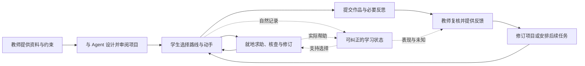

# PRD：项目制教学 Agent

版本：0.3 · 初稿依据：2026-10-04 · G0 负责人统一裁决：2026-10-09（Asia/Shanghai）

状态：G0 范围和实施条件已由项目负责人统一批准；本文为正式需求基线，尚非已实现产品。
下游：[MVP_SPEC](MVP_SPEC.md) → [TECH_DESIGN](TECH_DESIGN.md)

## 1. 产品定义

**为教师和学生提供一个由 Agent 支持的项目学习环境：教师与 Agent 共同设计值得探索的项目，学生在真实动手、试验、修订与人机协作中学习，教师根据具体表现改进支持和后续教学。**

项目体验是主线。学生画像用于选择适合当下的支持，过程记录用于理解学习和改进教学；它们伴随项目产生。首个教学环境是 CS Coding Workspace，长期产品的能力范围包括其他学科的项目工作对象。[S1]

### 1.1 本次已确认的决定

| 编号 | 决定 | 来源与影响 |
| --- | --- | --- |
| C-01 | 从研究进入 PRD → MVP_SPEC → TECH_DESIGN 阶段 | 2026-10-04 用户决定；不再把完成模拟作为产品定义前置条件 |
| C-02 | 首版采用独立 Web 应用，复用现有 IDE 的适用能力 | 本次用户确认；教师端、学生端和教学消息由自有应用承载 |
| C-03 | MVP 聚焦 CS 课程、个人项目、一位教师与少量真实学生 | 本次用户确认；不同时建设团队协作和多学科环境 |
| C-04 | 以技术研究 2026-10-03 校正后的 idea 为准 | 本次用户确认；学科知识、项目能力、人机协同与 AI 素养为三条并列能力线 |
| C-05 | Web UI 由团队成员负责，按其实际交付接入 | 2026-10-06 用户确认；本工作项不另行设计页面、布局、视觉或预设前端框架 |
| C-06 | 首发 C 程序设计，语言 C，先备为函数/数组/指针基础；K&R《C 程序设计语言（第 2 版·新版）》为教材 | 2026-10-09 项目负责人确认；不要求先学完整本书，不把教材 PDF 当学生项目输入 |
| C-07 | Web 学生空间内 TextScope Core（统计/检索/词频）→教师反馈→TextScope Report（报告文件） | 2026-10-09 项目负责人确认并批准活动适配；外部项目的本地环境/固定课时/六阶段/权重/线下答辩仅作参考 |
| C-08 | DeepSeek/deepseek-flash，基础数据规则与分段实施条件按 G0 统一裁决 | 2026-10-09 项目负责人批准；预算金额不入文档，真实数据/付费调用、执行就绪和真人试点仍按具体门禁落实 |

首发课程、活动、主模型和后台实施方案已在 G0 批准；当前未具备的账号、执行节点、模型/数据接入及试点条件，按第 9 节和下游门禁落实。裁决与五份文件写入授权见 [G0 裁决记录](../tasks/G0_CLOSURE_PROPOSAL.md#10-2026-10-09-负责人统一裁决及基线同步)。范围批准不表示运行环境或教学效果已验证。

Web UI 的页面组织、导航、控件、文案与前端实现以团队成员交付为准。本文描述用户任务与业务结果，界面相关举例用于说明行为，不作为另做一套 UI 的设计稿。后续围绕实际交付对接数据、后台与 Agent；必要功能若有缺口，先与 UI 负责人明确差异和调整范围。

跳过独立模拟阶段不等于取消工程验证或真实使用反馈。历史模拟和真实 T1 记录保留原样；不据此宣称旧方案的全部假设成立或失败。

### 1.2 三份文档的分工

| 文档 | 回答的问题 | 变更规则 |
| --- | --- | --- |
| PRD | 为谁解决什么问题，产品必须创造什么价值 | 产品方向、用户权利和核心流程变化先改本文件 |
| MVP_SPEC | 第一版具体做到哪里，怎样判定交付 | 定义业务行为、限额及验收；具体 Web UI 由团队成员交付 |
| TECH_DESIGN | 用什么结构和契约实现该范围 | 定义后台、Agent 与 UI 对接契约；不另定前端设计或扩大/缩减需求 |

出现冲突时，先回到已确认决定和 PRD 修订范围，再同步技术设计。研究报告是依据；实验文档仅约束对应实验；产品文档不覆盖工作空间的操作红线。

## 2. 用户、问题与价值假设

首批对象为高校 C 程序设计课程中的教师与学生，先备为函数、数组和指针基础；具体覆盖章节、支架和课时由试点教师按实际学生确定。结构体/动态内存可在项目中训练，不把外部参考的全书或课时估计作为入场要求。

| 用户 | 要完成的工作 | 当前材料指出的问题 | 产品要提供的变化 |
| --- | --- | --- | --- |
| 教师 | 将课程目标变成可探索、可实施、可评价的项目 | 设计任务、支持和评价容易脱节，AI 草稿需要大量核对 | 在同一份可编辑蓝图上形成项目、目标、资料、支架与评价安排 |
| 学生 | 理解问题、选择方案、试验修订、完成作品 | 泛化聊天需要反复描述上下文；直接答案和机械追问都可能妨碍学习 | 围绕当前作品就地求助，获得能继续行动的支持，并保留自主选择 |
| 教师 | 理解学生表现并决定下一步 | 终稿不足以解释过程，日志本身也不等于能力判断 | 从项目进展进入具体表现、帮助条件和未知，作出反馈或设计调整 |
| 学生 | 学会合理使用 AI | 仅统计使用量无法反映提问、分工、质疑和核查质量 | 在实际项目中练习判断 AI 建议，并复盘有效与无效的协作 |
| 试点维护者 | 让小规模活动可靠运行 | 本地实验的单机信任边界不能直接用于多人 Web 应用 | 有明确账户、活动范围、运行隔离、故障恢复和导出入口 |

上述问题来自团队研究与既有实验观察，尚无本项目的大样本需求或效果验证。产品假设是：共享项目上下文、受约束的个性化支持和可行动的教师反馈，能够改善项目学习体验并降低教师的无效工作；首版需要实际检查这些假设。

## 3. 学习目标与产品原则

### 3.1 三条能力线

| 能力线 | 培养机会 | 合理的观察 | 不应替代它的指标 |
| --- | --- | --- | --- |
| 学科知识与技能 | 理解概念、运用方法、解释结果、迁移到新条件 | 解释、预测、实施、变式表现及当时帮助条件 | 仅以程序通过或作品完成认定掌握 |
| 项目能力 | 界定问题、规划、比较方案、试验修订、交付反思 | 具体取舍、试验依据、修订与交付过程 | 编辑次数、在线时长或作品总分 |
| 人机协同与 AI 素养 | 提出问题、合理分工、判断建议、核查纠错 | 学生如何验证、调整或拒绝建议及其理由 | 提示词长度、求助次数、AI 建议采纳率 |

作品质量另行表达，不能合并替代三条能力线。教师为具体活动选择少量目标与观察方式，不要求每次互动覆盖全部目标，不输出无依据的综合“掌握率”。[S1]

### 3.2 贯穿流程的原则

1. **学生有真实选择。** 项目包含有意义的问题、受众或使用情境，允许不同方案、试验失败与修订；不能只给练习题换一个项目标题。
2. **先帮助学习继续，再判断是否需要补证据。** 求助不默认附带口试，缺失记录可以保持未知；必要测验提前说明。
3. **教师决定教学目标和正式评价。** 授权范围内的日常辅导自动进行，核心目标、量规和正式判断由教师决定。
4. **学生控制作品与操作。** MVP 中输入、修改、保存、运行和提交由学生发起；Agent 提供解释与建议。
5. **个性化可解释、可纠正。** 区分自述、观察、估计和教师判断；错误可以撤回并影响下一轮支持。
6. **帮助条件与协作能力分别表达。** 合理使用 AI 不自动扣分；得到帮助后的成功也不自动成为独立掌握证据。
7. **产品仍可在没有画像或模型不可用时使用。** 空画像不阻止开始项目，模型故障不阻止保存成果。

## 4. 核心使用流程

### 4.1 教师：从材料到可使用的活动

教师提供课程材料、学习目标、学生基础和时间/设备限制。Agent 起草少量项目方案及目标、任务、支持、证据和量规的关联。教师选择并直接编辑，也可要求局部修改；系统保留人工修改，标出受影响的关联项。

系统分别呈现配置错误、需要教师判断的设计疑点和未验证项。教师预览学生将看到的任务、辅导 Agent 可使用的资料、教师专属评价资产，确认一个固定活动版本并分配给试点学生。这里的“发布活动”仅指向授权学生开放，和将网站公开部署是不同操作。

### 4.2 学生：围绕项目行动

学生进入后先看到项目价值、预期作品、可选择路线、允许帮助和上次停留位置。可直接动手，也可请求协助规划；不强制先填写完整计划或完成诊断。

在工作区选中代码或引用运行结果求助，选择一点提示、检查这一步、概念解释、类似例子或方案讨论。学生能修正 Agent 的指向、追加帮助、质疑建议、表示“我先试试”。类似例子保留原任务与返回位置；AI 示例与学生作品清楚区分。

Agent 参考当前对象、课程规则和相关有效历史，提供一次有明确目的的支持后交还学生。无历史时依据当前请求工作。正常试验、停顿和粘贴不自动触发负面判断。

### 4.3 从产物到反馈，再进入下一轮

学生提交一个明确的作品版本，复用已有讨论与试验，按课程要求补充短反思或限定帮助检查。系统分别汇总作品结果、三条能力线的具体表现、帮助条件和未知；教师查看原始引用后确认、纠正、暂缓或反馈。

教师可以调整对该学生的支持，也可以发现资料、任务或量规的问题并制作下一版本。后续任务读取有效的修订状态，旧的错误主张不再作为有效依据。新任务重新开始一个尝试，旧提交和旧判断仍可追溯。

### 4.4 贯穿示例

首个活动 TextScope Core：学生在 Web 工作区编写 C/头文件并处理公开 ASCII 文本，实现基本统计、完整词检索和多文件合并词频，自主选择动态数组、链表、树或哈希等合理结构。学生自行确认源码、设置课程允许的运行参数、运行/检查、核查 AI 建议和提交；后台负责固定配置编译及独立隔离执行，学生不安装工具链或进入宿主终端。

教师复核作品、三条能力线、帮助和未知后，相关后续活动 TextScope Report 读取有效反馈，学生主动在新活动/尝试中复用与修订代码，生成报告文件并核查产物。两个活动版本与提交分别固定，不改写旧要求或错误判断。教材仅用于教学设计/获准知识检索；ASCII 数据、代码和报告是学习对象。

本活动由外部题材筛选适配而来，正式行为见 MVP_SPEC；不照搬原全书/固定课时/六阶段/评分权重/线下答辩或本地软件交付，不导入旧模拟记录。

## 5. 产品需求

| ID | 需求与用户结果 | 必须保持的边界 |
| --- | --- | --- |
| PRD-01 | 教师从材料获得可编辑的项目蓝图与设计建议 | Agent 实际参与起草；不能要求教师先手工提交完整机器配置 |
| PRD-02 | 任务、目标、量规、帮助与资源保持一致，并按版本和角色开放 | 教师确认；私有答案不随整包发给学生/辅导 Agent；已开始活动不静默变更 |
| PRD-03 | 学生在共同工作区选择路线、动手、试验和修订 | 当前项目对象优先；作品质量与能力判断分别表达 |
| PRD-04 | Agent 围绕同一版本的对象提供适切、受约束的个性化支持 | 不机械逐级解锁提示；过时上下文先同步；无画像时仍可求助 |
| PRD-05 | 支持学生练习提问、分工、比较、核查及调整 AI 协作 | 不以采纳率或求助数量评价 AI 素养；不接管学生的关键行动 |
| PRD-06 | 学习状态分层、可检查、可申诉和纠正，并用于后续支持 | 自述不是掌握证明；冲突/未知不抹平；纠正传播到依赖该结论的动作 |
| PRD-07 | 复用自然过程并按需检查，形成可解释的学习反馈 | 运行成功、课程验收、个人能力三者区分；模型不单独决定正式成绩 |
| PRD-08 | 教师从具体表现作出反馈、拓展或项目再设计 | 看板通向实际行动；不把所有困难归因于学生 |
| PRD-09 | 学生可拒绝帮助、返回项目、暂停过程记录并恢复工作 | 保存、采集、主动提示分别说明；断线或模型失败不能悄悄丢失已确认成果 |
| PRD-10 | 身份、资料范围、运行隔离、数据用途与故障状态清楚可控 | 不宣称完全观察或独立作答认证；不跨学生泄露；正式记录可导出 |

## 6. 产品边界与首版取舍

首版覆盖上述需求的一条纵向闭环，详细范围由 [MVP_SPEC](MVP_SPEC.md)定义。暂不建设完整 LMS、公共课程市场、多人实时协作、自动高风险评分、通用场景生成器、语音/三维课堂、深度知识追踪或在线策略训练。

跨课程复用通过清楚分离课程内容、教学状态与工作环境实现，首版只接一门课程和一种编程语言。第二种教学环境是否需要统一插件框架，由实际接入需求决定。

已有 student-ide 当前为 0.6.0，编辑、确认快照、回放、按需语言与编辑时诊断已有对应验收记录；它没有证明多人身份隔离、完整教学消息、宿主权限隔离或不可信代码沙箱成立。[S4] 这些能力供团队 UI 按实际需要复用，新 Web 集成须独立验证，不要求迁用原实验界面。

## 7. 成功标准与度量

首版先判断“完整流程能否被真实使用，以及是否值得继续迭代”。学习增益和教师节省时间是待验证目标，不能用完成率、满意度或模拟对话代替。

| 目标 | 首版观察方式 | 判断方法 |
| --- | --- | --- |
| 教师能完成设计与改进 | 保留起草、人工修订、预览、分配和课后再设计过程 | 能完成链路，设计失配可被发现并修正；时间按准备、复核、纠错分别记录 |
| 学生能持续推进项目 | 观察进入、选择、求助、试验、修订、返回与提交 | 报告完成人数/参与人数及受阻原因；特别记录系统造成的中断 |
| 支持与上下文相适应 | 教师审阅实际提示及后续表现；工程样例核对相关历史的使用 | 看支持是否适切、是否保留下一步行动；不是仅看动作标签不同 |
| 三条能力线得到培养机会 | 核对活动设计及真实出现的解释、取舍、核查行为 | 区分机会存在、行为出现与能力增长；不足部分保持未知 |
| 教师反馈进入下一轮 | 追溯复核到有效状态/新活动版本，再到后续支持 | 旧主张不继续生效；合理的新支持不必每次改变话术 |
| 系统可靠且边界可信 | 权限、版本、恢复、运行隔离及消息回执验收 | 关键项不通过不扩大试点，具体判据见 MVP_SPEC |

建议首轮使用 1 位教师、3–5 位真实学生，作为流程与可用性检验，非统计效果研究。报告同时保留失败、中途退出、未观测项与分母；不将体验好评包装成教学有效性结论。

## 8. 数据、控制权与评价边界

- 默认只处理所属课程和学生主动进入的项目。学生可查看记录范围、自己的反馈和争议入口。
- 编辑过程采集可暂停。作品保存、主动发送的求助及其必要上下文、提交和运行记录属于功能数据，需在界面明确说明；不能把“暂停过程记录”描述为所有数据均停止保存。
- 原始记录、模型候选和教师决定分开保存。模型输出、教师采纳和账号归属都不自动成为真实操作者身份或独立能力的证明。
- 涉及正式评价、核心目标/量规变更和争议，由教师决定。外部帮助不可观测时如实表达范围。
- 数据保留期限、访问人员和模型处理范围在真实试点前明确；仅收集完成教学流程所需数据。导出、撤回与经授权的删除应有明确处理途径。
- 开发阶段仅用合成数据。真实试点采用预置教师/学生账号和私有访问；教师处理教学异议，A 管授权/数据请求，C 管备份恢复。试点结束后 90 天复核去留，不自动删除，实际处置仍须单独授权。

## 9. 风险与待决策项

| 编号 | 事项 | 已批准决定与后置条件 | 落实角色/触发时点 |
| --- | --- | --- | --- |
| D-01 | 课程、先备、主/后续活动与语言 | C 程序设计/C，函数/数组/指针先备，Web 中 Core→反馈→Report；目标、帮助、检查按 MVP，教师确认实际蓝图/资料，C1 锁定编译器/镜像并验收 | 教师/A 在活动确认前落实教材段落与内容审阅；C 在 C1 落实环境，未就绪不开放活动 |
| D-02 | 主模型、数据范围与调用控制 | DeepSeek/deepseek-flash；模型配置按 TECH，预算金额不写文档，调用/用量/降级保留；真实处理/留存与付费调用条件未核验 | B 在真实模型验证前核实际账号/API/条款；教学/技术负责人在真实数据发送前确认范围/告知；凭据与付费调用另获授权 |
| D-03 | 账号、网络、人员、数据与资源 | 合成开发、预置账号/私有试点、90 天复核、不自动删除及教师/A/C 责任已批；节点/入口/访问与备份位置、真实试点条件后置 | A/C 按 TECH 的明确进入条件落实；C1 安全验收前不开放真人运行，真人试点前确认数据与访问 |
| D-04 | 实施分工、预算与验收责任 | 沿用既定 A/B/C/UI 分工，按任务依赖与阶段交付推进，对接实际 UI；不登记 A/B/C 实际投入时间或首批交付日期 | 团队；开始大规模实现前 |

2026-10-09，项目负责人取消投入/交付日期登记和文档预算金额要求，并统一批准 G0 的活动、模型/数据、技术契约和分段实施方案，明确授权同步五份基线。A1-P1/B1/C2 的首批进入条件见 TECH/TEAM；数据库、凭据/CI、删除和生产发布另行授权。环境/真实数据和业务验收保持未完成，不将统一裁决写成 A/B/C 逐人签认。

主要产品风险包括：项目题材缺乏意义、提示过强或无帮助、画像误判、教师复核反而增负、隔离运行成本超出小团队承受范围。应分别通过真实课程审阅、实际帮助复核、可纠正状态、教师时间记录和受限运行范围处理；不以增加通用平台模块替代这些判断。

本次用户已授权完成三份文档；没有授权数据库迁移、密钥/CI 配置修改、删除历史或公开部署。后续实施遵守 [AGENTS.md](../../AGENTS.md)。

## 10. 依据与追溯

| 来源 | 本文使用的内容 | 证据边界 |
| --- | --- | --- |
| S1：[产品方向与三条能力线](../reference/PRODUCT_RESEARCH.md#产品方向与三条能力线) | 原技术研究中的产品主线、能力目标与首版方向 | 筛选保留 2026-10-03 产品重心校正；研究建议不等于全部实现 |
| S2：[教师设计与反馈](../reference/PRODUCT_RESEARCH.md#教师设计与反馈)、[共同对象与交互连续性](../reference/PRODUCT_RESEARCH.md#共同对象与交互连续性) | T1/T2 的教师工作流，H1/H2 的交互与连续性 | 仅迁入影响当前首版的结论，原报告的全部 P0 不自动纳入首版 |
| S3：[研究证据与适用范围](../reference/PRODUCT_RESEARCH.md#研究证据与适用范围)、[工程衔接说明](../reference/ENGINEERING_HANDOFF.md) | 教学消息、角色视图、纠正传播与证据边界 | 沿用已明确的限制，不扩大既有验证结论 |
| S4：[复用范围与前提](../reference/ENGINEERING_HANDOFF.md#复用范围与前提)、[编辑时诊断](../reference/ENGINEERING_HANDOFF.md#编辑时诊断) | 原 IDE 可沿用的契约、能力和限制 | 历史能力不是正式产品的交付结果，新集成独立验收 |
| S5：[历史试验对开发的影响](../reference/ENGINEERING_HANDOFF.md#历史试验对开发的影响) | 真实 T1、模拟和闭环工程的有限发现 | 尚无完整真实课程结果；不作为新产品效果证明或旧实验前置要求 |

需求到首版能力、技术责任与验收项的逐项映射见 MVP_SPEC 第 9 节。

2026-10-08 的整理仅将必要来源结论与工程参考纳入团队可访问的文档，并更新引用，不变更已确认的产品方向、范围或验收要求。来源编号保持原有用途，团队无需访问原研究工作空间。
