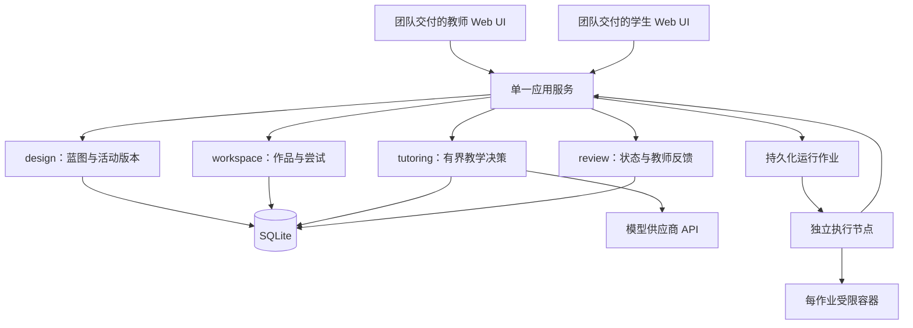

# TECH_DESIGN：独立 Web 教学应用

版本：0.2 · 初稿依据：2026-10-04 · 技术修订：2026-10-06 · 团队文档整理：2026-10-08（Asia/Shanghai）

状态：面向 MVP 的推荐技术基线；本次只编写设计，未创建应用、数据库或部署环境。  
上游：[PRD](PRD.md) → [MVP_SPEC](MVP_SPEC.md)

## 1. 架构结论与决策

**后台采用一个 TypeScript 模块化应用服务，统一教师设计、学生会话、学习状态和教师复核；Web UI 由团队成员交付，本工作项在其基础上接入后台与 Agent，学生代码交给独立执行环境。** 小规模试点先用单机 SQLite 和持久化作业记录，模型调用有界，课程资料按权限和目标检索。教学内核不依赖 Codex 宿主。

独立 Web 承载与 Web UI 分工已由用户确认；下表中的后台选型及接入技术仍是推荐方案，不冒充用户逐项确认或本机验证结果。本文件不另行定义前端框架、页面、组件布局或视觉设计。

| ID | 决策 | 原因与取舍 | 改选条件 |
| --- | --- | --- | --- |
| TD-01 | 独立 Web 应用，应用自己管理教学消息和回执 | 用户已确认；补齐宿主 Hook 无法保证的完整消息链 | 若产品方向改变，先修订 PRD |
| TD-02 | Web UI 沿用成员交付；后台建议 Node.js LTS + TypeScript + Fastify | 保持已确认分工，利用现有 Node 经验实现教学业务 | 按实际 UI 工程核对接入方式；不要求前端为后台选型更换框架 |
| TD-03 | SQLite + better-sqlite3；单应用进程负责业务数据库 | 1 位教师、小队列、单机部署；事务能表达版本和纠正一致性 | 多实例/多机写入成为必要，或批量同步后写竞争仍不达标，再迁 PostgreSQL |
| TD-04 | AI SDK Core 的有界调用；按职责隔离上下文 | 复用调用与工具循环能力，不造通用 Agent 平台 | 持久化分支/外部等待成为主要复杂度时再评估工作流框架 |
| TD-05 | 结构化状态 + 引用原文；无需向量库或外部记忆产品 | 首版课程材料小，课程/目标过滤后可做明确检索 | 固定查询评估证明召回不足，再加检索能力 |
| TD-06 | 复用确认快照/事件语义，编辑能力按团队 UI 实际需要接入 | 已有实验提供实现依据；复用逻辑不等于复制原界面 | 结合成员交付决定具体迁用模块，保持对象版本与记录语义 |
| TD-07 | 独立 Linux 执行节点/VM + 受限容器 | 原 runner 是本地进程执行，不是多人代码沙箱 | 当前环境不能落实隔离则阻止真人运行，不回退到应用宿主执行 |
| TD-08 | SQL 作业记录、HTTP 命令、SSE 通知 | 无多人共编，首版不需要 Redis、消息总线和 WebSocket 同步平台 | 实测推送/队列规模超出此结构再扩展 |

选择 SQLite 的依据是单机低写并发，而非“学生数量少就必然安全”：它仍只有一个并发写者，WAL 不能放在网络文件系统上。[SQLite 使用边界](https://www.sqlite.org/whentouse.html)、[WAL](https://www.sqlite.org/wal.html) 支持这些约束；适配本项目的结论是本文推断。

## 2. 部署与模块边界



图中的业务模块同进程部署，共用 access/records，不各自成为服务。独立执行节点是安全边界。模型调用和网络 I/O 异步进行，不能占住数据库事务或阻塞编辑确认。

| 模块 | 责任 | 禁止越过的边界 |
| --- | --- | --- |
| access | 登录、课程成员、资源归属、阶段与命令授权 | 不能信任请求体中的 role/studentId 来决定权限 |
| design | 材料版本、蓝图、局部建议、一致性检查、角色预览与分配 | 模型只能提议；确认活动来自教师命令 |
| workspace | Attempt、文件状态、确认快照、运行/提交、恢复位置 | 学生作品写入只能由本人授权操作；不接受模型写文件命令 |
| tutoring | 上下文装配、动作选择、输出校验、取消与投递 | 不持有学生文件写入、运行、正式评价或活动发布工具 |
| review | 候选证据、状态投影、异议、教师决定和后续任务 | 候选与正式判断分开；纠正必须使旧依赖失效 |
| records | 记录持久化、覆盖区间、幂等、作业、导出与审计 | 不从总结反向伪造原始记录；不接管教学判断 |
| runner | 固定镜像/快照执行，资源约束和可信验证结果 | 学生程序不能访问应用数据、凭据或验证器内部答案 |

后台代码可在 apps/teaching/ 下按 server、runner、contracts 组织，server 再按上表业务责任拆分。前端保留团队交付的工程结构与构建方式，接入时确认仓库位置，不预建或要求迁移到指定 web 目录。contracts 表达接口字段、状态和校验语义，不要求前端与后台共用同一种语言或校验库。

该目录本次不创建。本仓库尚无正式应用的启动与测试命令；后续按团队实际 UI 工程和后台结构设置，不将旧 IDE 实验的启动命令作为产品入口。

## 3. 技术栈与已有能力复用

### 3.1 最少依赖

| 位置 | 推荐 | 使用范围 |
| --- | --- | --- |
| Web UI | 沿用团队成员实际交付，不另作选型 | 对接数据、操作和状态；页面、组件、构建及渲染方式由 UI 工程决定 |
| API | Node.js 受支持 LTS、TypeScript、Fastify | 业务 API、鉴权和 SSE；通过同源入口与团队 UI 接入 |
| 数据校验 | Zod | 复用已有知识，定义应用维护的输入/模型结果 schema |
| 持久化 | better-sqlite3、SQLite WAL | 短事务、预编译参数查询、JSON 保存小型版本化文档 |
| 模型 | AI SDK Core + 一个供应商适配包 | 结构化候选、有限读取工具和取消；业务状态由应用保存 |
| 执行 | 固定 Linux 镜像、容器资源约束 | 仅首发语言；镜像和命令由维护者批准 |
| 验证 | Node 测试运行器、浏览器端到端工具 | 事务/权限/状态测试及真实 UI 流程；不先搭完整评测平台 |

实施时在后台工程锁文件中固定实际依赖版本，验证 Node、Fastify、Zod/模型 schema 和 SQLite 驱动组合。前端依赖以成员交付为准；若复用实验编辑器，再验证其 worker、对象引用与前端构建的兼容性，不预设某套组合已经可用。本轮未安装或升级依赖。

既有技术回源确认：Fastify 支持 schema 校验，但 schema 应作为应用代码，不能接受学生上传的可执行 schema；AI SDK 的循环控制提供停止条件和步骤上下文调整，不能替代业务授权。[Fastify 校验](https://fastify.dev/docs/latest/Reference/Validation-and-Serialization/)、[AI SDK 循环控制](https://ai-sdk.dev/docs/agents/loop-control)

### 3.2 复用清单

| 本仓库中的复用参考 | 可迁用部分 | 必须改造/重新验收 |
| --- | --- | --- |
| [编辑与对象版本](../reference/ENGINEERING_HANDOFF.md#编辑与对象版本) | 编辑、选区、版本与草稿恢复的语义 | 按成员 UI 交付适配对象引用、认证资源路由与多标签冲突；不重做其页面 |
| [记录确认与回放](../reference/ENGINEERING_HANDOFF.md#记录确认与回放) | 文本变化、确认/去重、哈希与回放语义 | 实现课程/尝试作用域；状态/历史不能按全局路径混用 |
| [运行与语言环境](../reference/ENGINEERING_HANDOFF.md#运行与语言环境) | 源码快照、编译/运行阶段、环境指纹与失败分类 | 用隔离执行器替代宿主进程；命令白名单和结果来源重做验收 |
| [教师纠正与历史版本](../reference/ENGINEERING_HANDOFF.md#教师纠正与历史版本) | 活动版本、TeacherReview、revision 与原始/推断分离的业务经验 | 实现真实身份与事务；不导入模拟身份/能力记录 |
| [历史试验对开发的影响](../reference/ENGINEERING_HANDOFF.md#历史试验对开发的影响) | 有来源的回归风险与原能力边界 | 新 Web 集成独立验证，历史实验通过数不计入新应用通过数 |

上述契约已迁入本仓库，团队可直接依据正式接口实施。旧插件代码尚未作为本仓库依赖交付，不能假设原模块可直接导入；若后续决定迁用小范围纯逻辑，再评估源码、依赖与对应检查并保留来源，不把整个插件服务嵌入新应用。学生操作与模型权限按本文件和 AGENTS.md 的正式边界实现。

2026-10-06 的历史 student-ide 0.6.0 已有编辑时诊断的隔离验收记录；团队所需的[诊断契约与限制](../reference/ENGINEERING_HANDOFF.md#编辑时诊断)已收录。正式首版语言仍待冻结，是否迁用具体实现及如何呈现结合成员的 Web UI 决定，不把历史多语言覆盖作为首版必须实现的范围。

### 3.3 与团队 Web UI 对接

接入以成员实际交付的工程/原型为起点，先核对已有操作、状态、构建方式和接口约定，再把后台能力对应到这些操作。本轮未收到并审阅该交付，不推断其框架或完成程度。

对接需保留四类语义：用户与课程范围；当前对象及其版本；命令结果、错误与恢复方式；实际消息展示、取消和确认回执。接口路径/字段命名可按实际工程协商适配，权限、版本、幂等和记录含义不能静默丢失。

页面与组件由 UI 负责人维护，后台与 Agent 工作围绕其交付接入。未覆盖的必要业务能力先列出具体差异与最小调整建议，再与负责人对齐；不另建一套界面替代交付。UI 尚不可用时可先完成接口和状态测试，完整浏览器验收在实际集成后进行。

2026-10-08 按用户要求补充[三人分工与交付顺序](../planning/TEAM_WORK_PLAN.md)：前期三人按本文的业务/接口契约完成后台、Agent 与独立执行能力，UI 成员仅在最后实际接入阶段参与分工。届时再核对实际工程、操作、构建与适配，补齐浏览器和完整链路验收；不把前期核心开发变成等待 UI 交付，也不假设最终接口无需适配。此排程不改变模块、权限、版本或验收语义。

## 4. 核心数据模型

以下是新产品的逻辑数据设计，不是现有数据库变更，也没有执行建表或迁移。业务查询按 courseId、studentId、attemptId 缩小范围；原始学生内容默认不进入普通应用日志。

| 对象 | 核心内容 | 不变量 |
| --- | --- | --- |
| User / CourseMembership / Session | 账号、课程角色、有效登录会话 | 身份由服务端会话获得；角色按课程判断 |
| ResourceVersion | 材料正文、段落 ID、来源、可见范围、内容 hash | 内容版本固定；检索前先过滤角色 |
| BlueprintDraft | 目标/任务/证据/量规关系、资料、政策、revision | 修改用预期 revision；AI 提案不能覆盖并发编辑 |
| ActivityVersion / Assignment | 教师确认的完整活动与分配范围、各资源/政策/量规/运行版本 | 已确认内容不可变；Assignment 可暂停，新版本需显式分配 |
| Attempt | 学生、活动版本、状态、项目意图、路线、返回位置、decisionEpoch | 学生归属和活动版本固定；epoch 使过期动作失效 |
| ProjectFile / ArtifactSnapshot | 文件实例、内容版本、确认文本；不可变的多文件快照及 hash | 同名重建是新实例；运行/提交引用快照而非当前路径 |
| Message / TeachingAction / ActionReceipt | 实际内容、动作目的、依据、预期状态、生命周期与展示回执 | 生成不等于展示；内容不能只剩不可回取的 hash |
| Observation / CoverageInterval | 代码/解释/运行/实际帮助的引用、来源、时间、缺口 | 观察由采集或明确输入产生；模型不可伪造原始事实 |
| RunRecord / CheckResult / Submission | 环境、源码 hash、退出/资源状态；验证规则和判断；固定提交 | 运行、课程检查、正式评价分别保存 |
| LearnerStateRevision | 适用范围、三条能力线主张、帮助条件、支持/反证、未知 | 版本追加；被撤回主张不进入当前有效投影 |
| TeacherDecision / Feedback | 对哪个版本/主张的确认、纠正、暂缓，理由、引用、后续行动 | 教师身份可信；无证据时只能改变判断状态，不能补造观察 |
| Job / CommandReceipt / AuditEvent | 作业与租约、幂等键、请求摘要、结果、操作审计 | 重试不能重复业务副作用；审计不包含凭据或整段私有对话 |

目标拥有稳定 competencyId 和 domain/project/ai_collaboration 类别；任务、目标、证据要求为多对多关系。课程目标语义改变需新版本或显式对应关系，不能因复用 ID 将旧表现视为新目标证据。

首版可将小型蓝图、量规、状态主张放在版本记录的 JSON 字段中；权限键、关联 ID、revision 和幂等键有独立列、索引和约束。逻辑对象不要求全部拆成独立表，但必须能做所属范围与引用完整性检查。

### 4.1 共同对象引用

新的工作区对象引用至少包含下列信息，字段为设计契约：

```typescript
type CodeObjectRef = {
  kind: "code";
  attemptId: string;
  snapshotId: string;
  fileId: string;
  path: string;
  documentVersion: number;
  contentHash: string;
  range?: { startLine: number; startColumn: number; endLine: number; endColumn: number };
  source?: {
    system: "student-ide";
    session: string;
    modelId: string;
    seq?: number;
  };
};

type ObjectRef =
  | CodeObjectRef
  | { kind: "run"; attemptId: string; runId: string; snapshotId: string }
  | { kind: "resource"; attemptId: string; resourceVersionId: string; paragraphId: string }
  | { kind: "project"; attemptId: string; activityVersionId: string };
```

路径和行号只在对应版本内解释。范围字段不得定位到另一个文件实例；服务端核验 snapshotId 与内容 hash。运行、资料和项目级问题各自绑定对应版本，不强迫“帮我找起点”的学生先选择一段不存在的代码。迁用历史引用时原 session/modelId/version/hash/seq 保留来源含义；其中 modelId 是文档实例，不是模型供应商版本。

### 4.2 学习主张

每条主张保存 competencyId、scope、statement、evidenceIds、counterEvidenceIds、assistanceStatus、unresolved、estimatorVersion 和 validity。state 取 insufficient / supported_with_assistance / supported_in_check / conflicting；validity 另取 active / contested / superseded / withdrawn。

assistanceStatus 至少区分 observed_help、none_observed_in_system、unknown。none_observed_in_system 只表达本系统范围，不等于没有外部帮助。采集缺口或缺展示证据影响解释时，使用 unknown，不升级为独立掌握。

模型总结引用原始材料，不作为新增的独立证据。同一次 Attempt 的关联观察按同一证据组处理；首版不计算重复事件累积的掌握概率。

## 5. 命令、权限与外部接口

浏览器通过同源 HTTP 发命令，长任务返回 jobId，通过 SSE 接收状态和已审查结果。SSE 断线按服务端事件游标补取；消息内容在获准展示后才下发，不能先流式泄露未经检查的答案。

所有变更命令均校验认证会话、课程成员、资源归属、状态与预期版本。Idempotency-Key 按账号 + 路由/资源 + 命令范围唯一，保存请求摘要；同键同请求返回原结果，同键不同请求返回 409。

| 接口（设计） | 发起者 | 行为与关键限制 |
| --- | --- | --- |
| POST /api/sessions；POST /api/logout | 账号本人 | 登录/退出；会话、CSRF 与登录限流，不能直接指定教师角色 |
| POST /api/courses/:id/resources | 教师 | 导入 TXT/Markdown/粘贴正文，创建材料版本，非任意 URL 抓取 |
| POST /api/courses/:id/blueprints | 教师 | 新建蓝图；Agent 起草为异步 job，结果先是建议 |
| PATCH /api/blueprints/:id | 教师 | expectedRevision + 局部变更，原子更新 |
| POST /api/blueprints/:id/proposals | 教师 | 提交局部 AI 修改要求；提案绑定基础 revision，采用仍走 PATCH |
| POST /api/blueprints/:id/checks | 教师 | 返回配置错误、设计疑点、待验证项 |
| POST /api/blueprints/:id/releases | 教师 | 确认当前 revision 为不可变活动版本，阻断错误不可跳过 |
| POST /api/activities/:id/assignments | 教师 | 分配已确认版本，限定课程成员 |
| POST /api/assignments/:id/controls | 任课教师 | 暂停/恢复分配，增加相关 epoch 并取消待执行动作 |
| POST /api/assignments/:id/attempts | 所属学生 | 创建或返回该任务的当前尝试 |
| POST /api/attempts/:id/sync | 所属学生 | 批量确认文件变更/新建/回收，校验 fileId/baseVersion/clientSeq，回传 ACK |
| POST /api/attempts/:id/help | 所属学生 | 确认问题与 ObjectRef，创建有界辅导 job |
| POST /api/attempts/:id/runs | 所属学生 | snapshotId + 批准 profile + 输入，创建运行/课程检查作业 |
| POST /api/attempts/:id/controls | 所属学生 | 暂停/恢复尝试、过程采集与主动提示分别设值 |
| POST /api/jobs/:id/cancel | 有权发起该作业的用户 | 停止生成/运行；校验作业范围，取消不抹掉已产生的真实结果 |
| POST /api/attempts/:id/submissions | 所属学生 | 固定快照、说明与课程检查引用 |
| POST /api/actions/:id/receipts | 所属学生客户端 | 回传实际展示/取消/确认状态，校验接收对象与 action 内容版本 |
| POST /api/attempts/:id/disputes | 所属学生 | 对主张/反馈提出异议，不能直接改成“已掌握” |
| PATCH /api/courses/:id/my-context | 所属学生 | 修改个人目标/约束自述，不覆盖能力推断或教师决定 |
| POST /api/attempts/:id/reviews | 任课教师 | expectedStateRevision + 决定、引用、理由；事务内纠正和失效 |
| POST /api/attempts/:id/reopen | 任课教师 | 允许修订，保留旧提交；学生再主动进入 |
| GET /api/attempts/:id/events | 所属学生/任课教师 | 经过角色裁剪的 SSE 或游标分页 |
| GET /api/courses/:id/exports | 任课教师 | 课程范围导出；学生通过个人导出入口仅获取自己的可见记录 |

读接口同样校验范围，不因 ID 难猜就放开。不存在用于模型直接发布活动、编辑学生文件、运行程序或写正式评价的公共工具。模型能调用的是当前已授权上下文中的少量读取函数，如读取指定快照、读取结果、检索获准资料；调用参数再由服务端校验。

常用错误码：401 未登录、403 无权限、409 版本/幂等冲突、413 超出内容限额、422 配置或引用不成立、429 预算/限流、503 模型/执行器不可用。返回可恢复说明与 requestId，不暴露内部路径或密钥。

## 6. 教学决策与上下文

### 6.1 一次求助的处理

1. 鉴权并校验 Attempt active、帮助政策、请求限额与幂等键；记录学生消息。
2. 代码对象先确认所选源码已同步；其他对象核验相应运行、资料或活动版本。读取 activityVersion、decisionEpoch 和 learnerStateRevision。
3. 构造最小上下文：当前问题/对象、必要运行结果、活动目标与政策、相关有效主张及反证、最近实际帮助、获准课程段落。
4. 确定性规则先处理无权限、限定检查、缺上下文、环境故障和已关闭提醒；其余由模型在有限动作中选择并生成内容。
5. 校验结构、引用、内容范围、帮助政策和版本。失败最多修复一次，且计入总调用/时限；仍不满足则安全结束并允许人工求助。
6. 投递前再次核验政策、epoch、主张有效性和目标版本，保存获准内容并发送通知。过时结果取消，不将旧选区批注到新代码。
7. 前端在本地再次比对当前文档版本，展示后回执。随后等待学生，不自动执行下一步或反复测验。

首版动作类型可用 plan、clarify、hint、explain、compare、verify_suggestion、reflect、extend、handoff_teacher、no_action。类似例子优先引用教师批准的相邻样例；不通过模型自由生成并执行 HTML/脚本。

上下文中保留可审阅的选择依据，如“上次在有提示条件下解释正确，迁移仍未知”；不需要存储或展示模型内部思维链。输出携带简短 rationale、evidenceIds 和 expectedStudentAction，便于审阅实际支持目的。

### 6.2 约束与降级

单次教学请求的模型调用总数 ≤ 3，包含工具循环和一次修复；从请求接受到终结含排队 ≤ 45 秒，使用独立超时/取消控制，不能只依赖 SDK 默认循环次数。每个 Attempt 同时最多一个有效辅导 job；新请求使旧请求取消或由学生明确继续。

队列满时明确排队位置/状态，超时结束；不存在为了凑结果无限重试。超预算或模型不可用时保留作品、问题和人工求助入口。

普通教学输出的语义边界无法靠 schema 或关键字证明。首版通过限制上下文、有限动作、获准例子、输出检查和教师抽查降低过度帮助；限定帮助检查直接关闭不允许的辅导入口。确定性权限拒绝与语义质量评审分别验收。

### 6.3 资料检索与状态提取

材料按教师给定标题/段落切分，先按课程、角色、活动版本与可见性过滤，再按目标关联及词项匹配选择少量段落。小材料可直接放入预算；上下文超限时明确省略范围，不无声截断关键规则。首版不共享跨学生的上下文缓存。

状态提取在学生主动求助后的有效结果、里程碑、提交和教师复核等低频节点异步进行。每次记录实际输入引用、模型/提示/规则版本和输出。原始编辑事件只聚合，不能每次编辑都触发模型。

提取结果需通过引用和来源校验后成为候选主张，再生成状态 revision；分析基于旧 revision 时拒绝直接写入，按最新有效证据重新计算。学生可继续操作，不等待画像更新。

## 7. 一致性、纠正传播与恢复

### 7.1 状态和版本

- BlueprintDraft 每次教师修改增加 revision；AI 提案绑定基础 revision。确认版本时同时冻结活动、量规、政策、资源和运行配置引用。
- Attempt 使用 ready → active → submitted → reviewed → closed；active 可进入 paused 再恢复。reviewed 重开修订须教师允许，原 Submission 不变。
- Assignment 的暂停优先于 Attempt。学生不能通过恢复尝试绕过教师暂停，模型也不能改变阶段。
- decisionEpoch 在新求助取代旧求助、控制权/帮助政策变化、任务暂停和相关教师纠正时递增。文件内容另外通过 snapshotId/documentVersion 检查。
- 功能数据同步、过程采集开关与主动提示开关分开保存。关闭过程采集不等于关闭显式消息/提交；关闭主动提示不等于拒绝学生自己求助。

### 7.2 教师纠正事务

一次 POST reviews 在一个短事务中完成：

1. 校验教师课程权限和 expectedStateRevision。
2. 追加 TeacherDecision，保存引用、理由与被更正主张。
3. 生成新的 LearnerStateRevision，撤回/修订相关主张；对依赖被否定依据、尚未重算的主张标 contested，暂不用于强适应。
4. 对该学生、该课程内受影响的活动增加 decisionEpoch，将未完成/未展示的相关动作和分析 job 标为 stale。
5. 追加状态事件与必要的重算作业，提交后通知客户端。

首版采用“该学生在该课程内的相关待执行动作整体失效”的保守办法，不实现通用依赖图调度器。支持/反证引用仍保留，以便定位影响。重算读取有效教师决定，不能重新调用模型就恢复被教师明确撤回的同一主张。

旧模型请求即使无法及时中止，其完成结果也因 revision/epoch 不符而不能生效。已显示的帮助保持真实历史，另标其依据后来被修订，不能抹掉学生曾经收到的帮助。纠正判断不等于改变当时的帮助条件。

### 7.3 投递与回执

TeachingAction 保存生成内容、策略/模型版本、来源引用、expectedStateRevision、decisionEpoch、目标版本和可展示内容 hash。通过校验后进入待投递；服务端写出 SSE 只算发送尝试。

| 回执 | 由谁产生 | 可据此说明 |
| --- | --- | --- |
| received | 已认证的目标客户端 | 客户端收到指定版本内容，产品可标“已投递” |
| displayed | 客户端确认目标消息已渲染且页面可见 | 本系统报告内容已展示，不证明学生阅读或理解 |
| acknowledged | 学生明确点击/回应 | 有一次明确确认，不自动代表采纳或掌握 |
| cancelled / stale / failed | 客户端或服务端相应状态机 | 取消、过时或失败，保留发生原因和已取得的其他回执 |

回执按 actionId + contentHash + receiptKind + clientReceiptId 去重，不根据重发次数增加帮助或能力权重。展示可以先于某个迟到网络回执到达，按事实追加，不强制伪造中间阶段。

投递前的服务端检查与前端本地版本检查共同阻止已知过时内容。断线时先重新同步 epoch 才显示待投递消息；迟到的旧展示回执标记与当前状态冲突，不回滚新判断。纠正发生在消息已显示之后时只能标注撤回依据，不能承诺让学生“没看见过”。

### 7.4 编辑、断线和幂等

同步批次包含 clientId/clientSeq、fileId、baseVersion 和内容变化。服务端去重、核对基版本、落盘后才 ACK；时间顺序使用服务端 seq，不能用客户端时钟决定覆盖顺序。

一个学生允许多个页面读取，但同一文件的并发写入使用乐观并发控制；冲突时保留本机草稿和服务器版本供比较，不首发 CRDT。文件回收是可恢复的生命周期状态，新建同名文件生成新 fileId。

浏览器 IndexedDB 保存本机未同步草稿，键包含账号与 attemptId；账号切换不能暴露前一用户草稿。存储不可用时明确提示。断网继续本机编辑，停止假装已同步的求助/运行；重连后先解决版本冲突。

过程采集关闭时，sync 仅维持必要的最新确认作品，不保留逐次编辑时间线、不排队被动分析；显式求助、运行和提交固定必要快照。重新开启不上传关闭期间的逐次编辑。服务器也检查开关，不能仅在 UI 隐藏日志。

Job 记录 kind、scope、status、leaseUntil、expectedRevision、attemptCount、deadline 和结果引用。重启后续取未完成作业，过期作业先核对结果；不盲目重放外部副作用。模型请求重试可能再次产生供应商费用，费用记录与业务去重分别处理。

## 8. 代码执行与课程验证

### 8.1 执行请求

只有学生显式发起运行/检查，或教师在准备活动时发起样例验证。辅导模型没有执行入口。执行器接收 runId、不可变 snapshotId/hash、runtimeProfileVersion、入口、输入、限额与验证模式；命令和镜像来自批准配置，不接受用户任意 shell 字符串。

队列分派前重新校验活动状态和权限。每个 Attempt 最多一个运行作业、全局最多两个；学生能取消，排队/运行状态可见。运行节点按 runId 持久记录接收和结果，重复分派返回同一作业。

丢失连接时应用先查询同一 runId。若无法判断是否执行，标记 outcome_unknown，等待执行器恢复或学生明确新建运行；不能悄悄重复执行并伪装成同一次。

### 8.2 隔离要求

首发代码在专用 Linux 执行节点/VM 的每作业容器中编译和运行。开发机可通过单独测试 VM 验收，不能因为 Windows 上已有 GCC 就在应用宿主直接运行学生代码。

- 镜像按 digest 固定，工具链预装，非 root；去除非必要 capabilities，启用 no-new-privileges 和受限 seccomp 配置；没有特权、宿主 PID/网络命名空间或容器引擎 socket。
- 网络默认关闭；只读根文件系统与源码，唯一可写临时空间受限，不挂载应用目录、数据库、密钥或其他作业目录。
- 路径规范化并校验全部文件清单；拒绝绝对路径、父目录逃逸和符号链接。入口必须在当前快照内。
- 限额使用 MVP_SPEC 的 NFR-03：1 CPU、512 MiB、64 进程、128 MiB 临时空间、64 KiB 总输出；编译 30 秒、执行 10 秒；内存与 swap 合并上限须一致落实。
- 超时/取消终止整个作业隔离单元，分别记录 timeout、cancelled、oom、output_limit、compile_error、program_error、infrastructure_error。
- runner 控制面只允许受认证的应用服务提交/查询已授权作业；其最小权限凭据不注入学生进程。

Docker 默认不会自动设置 CPU/内存限额，必须显式配置并实际核验；容器共享宿主内核，因此专用节点还要隔离应用数据和控制面。[资源限制](https://docs.docker.com/engine/containers/resource_constraints/)、[安全边界](https://docs.docker.com/engine/security/) 仅证明机制存在，不能代替本项目 AC-10 验收。首版不承诺可直接向匿名公众开放任意代码。

### 8.3 可信课程验证

RunRecord 是执行事实，CheckResult 是指定课程规则的判断。验证器在学生进程之外读取受限输出并比较，私有答案和判定逻辑不挂入学生容器；测试输入按运行需要提供，不能将“输入保密”当作抗作弊保证。

CheckResult 记录源码/输入 hash、规则版本、验证器版本、镜像 digest、结果来源和覆盖范围。学生 stdout 只能是被检查的数据，不能声明通过；环境 smoke 结果只支持环境就绪。

私有测试的完整输入/答案、日志和判定细节按角色裁剪，辅导端只获取政策允许的诊断。限定帮助检查从入口起禁用相应辅导；允许的解释/替代证据由活动配置，不临时改变评分要求。

## 9. 身份、资料与数据治理

首版为课程内预置账户或受控邀请账户，不做公共注册、SSO 或复杂角色层级。使用维护中的会话组件，安全随机的服务端 Session、HttpOnly/Secure/SameSite cookie，以及变更请求的 Origin/CSRF 校验；不把长期登录凭据放在浏览器 localStorage。

密码使用成熟密码哈希方案，例如 Node crypto.scrypt 的逐账号随机 salt 配置，避免自创算法；参数和登录限流在实施时核验。开发中的临时账号与真人账号隔离，账号凭据不进入源码、导出、提示词或普通日志。

授权顺序为身份 → 课程成员 → 资源归属/可见性 → 当前阶段 → 命令范围。所有检索、下载、导出、SSE 和模型读取使用相同规则。前端隐藏按钮不构成权限边界；经认证的账号也不证明每个动作由同一自然人执行。

课程资料、学生代码和工具输出都作为不可信内容：不得修改系统政策或工具权限。Markdown 禁止执行原始脚本，输出渲染经过转义/净化；课程上传只有文本格式和大小限制，不加载远程代码。首版资料建议单文件 ≤ 256 KiB、课程总正文 ≤ 2 MiB，超出则要求拆分并明确提示。

原始事实由用户操作/受信服务写入；模型只能提交候选分析。采集开关变化记录时间区间及功能数据例外，学生可看到覆盖缺口。

数据保留期限由 PRD 的 D-03 在真人试点前确定，可建议试点结束后 90 天复核去留，但不得把建议当作已同意的自动删除。应用层“追加记录”不意味着个人数据永久保留或防篡改认证。实际移除数据时需经授权，并同步使依赖引用失效；撤回或脱敏产生的证据缺失不再用于能力判断。

向模型供应商发送的范围限于获准材料和当前学生的必要上下文。D-02 未确认数据处理与预算前只用合成工程样例。供应商名称、区域和具体数据条款是待确认部署条件，不以本文代替政策核实。

## 10. 持久化、运维与成本

### 10.1 SQLite 基线

数据库放在应用节点本地持久磁盘，启用外键、WAL、合理 busy_timeout 和短事务；模型调用、编译和网络等待一律在事务外。内容以带权限归属的文本/小型二进制记录保存，避免首版额外引入对象存储和双写一致性问题。

短期 SQL 查询使用参数绑定和必要索引；高频编辑批量同步。同步驱动中不做大规模全量扫描或压缩操作，导出和重算按分页拆分，观察事件循环延迟。10 个活跃会话能否达标必须按 NFR 实测，不能仅凭 SQLite 选型推定。

SQLite 官方已记录 WAL-reset 问题及修复版本；冻结驱动时应实际查询内嵌 SQLite 版本，使用 3.51.3 或之后已修复版本，不能只看 npm 包版本。[WAL 修复说明](https://www.sqlite.org/wal.html) 这是一项版本检查要求，本轮未修改现有依赖。

运行时做一致性备份，不能只复制活跃主数据库文件而遗漏 WAL 状态。新应用备份与原实验证据分开。建议每次教学会话前后备份，故障恢复目标先设 RTO 30 分钟、备份恢复 RPO 为最近一次成功备份；正常进程重启不能丢失已经 ACK 的已提交事务。节点磁盘彻底损坏不在“零损失”承诺内。

### 10.2 最小运维

建议两个运行边界：一个持久应用节点，一个独立代码执行节点；受控网络和 HTTPS 前置入口按现有基础设施配置。无需 Kubernetes、多个业务微服务或全天运行的自主 Agent。

健康检查分别报告应用、数据库、模型供应商和执行器状态。模型/执行器故障允许降级，存储无法确认写入时不能显示保存成功。维护恢复不能替学生切换学习状态。

时间戳统一保存 UTC，展示按用户时区，当前项目默认 Asia/Shanghai。日志保留 requestId、jobId、事件类型、时延、失败分类、配置版本；正文与敏感内容仅在授权业务记录中按需查看。

部署密钥、CI/CD、数据库建表/迁移、删除和公开发布均为后续实际操作，按 AGENTS.md 另行获得所需授权。本次没有生成这些配置或执行脚本。

### 10.3 成本控制

记录每次模型输入/输出用量、供应商实际 usage 是否可得、重试和错误成本；未知用量标未知，不按零计。模型单价在实际选型时核对，计算每请求、每 Attempt 和试点总费用。

采用每账号/课程的调用配额、单轮次数/时间限制、有限上下文、提交节点批处理状态更新，以及执行队列限额。预算上限触发后暂停新的模型调用并给出清楚反馈，保存、已有反馈和教师人工审阅不受影响。

首版不引入自动跨模型降级，以免帮助行为和数据处理范围静默改变；要更换模型时显式记录新配置版本并跑必要回归。

## 11. 验证与实施约束

验收编号以 [MVP_SPEC 第 6 节](MVP_SPEC.md)为唯一清单，本节明确责任：

| 层次 | 必测内容 | 对应验收 |
| --- | --- | --- |
| 数据与权限 | 角色裁剪、跨课程拒绝、引用完整性、版本 CAS、幂等摘要、教师纠正事务 | AC-02、AC-06、AC-07、AC-08、AC-15 |
| 团队 Web UI 集成 | 在实际交付上验证选区引用、保存/草稿、文件回收、停止、返回、采集暂停与可访问操作 | AC-03、AC-04、AC-05、AC-11 |
| 运行 | 镜像/快照绑定、路径限制、资源/网络/文件隔离、可信结果 | AC-04、AC-10、AC-15 |
| 恢复 | 应用与执行器重启、迟到回执、掉线、取消竞态、导出/备份恢复 | AC-06、AC-08、AC-09、AC-12 |
| 教学语义 | 草案一致性、提示适切、相关历史使用、帮助条件、未知/反证 | AC-01、AC-05、AC-07、AC-16 |
| 实际使用 | 教师从资料到再设计，学生探索、协作、修订与后续任务 | AC-13、AC-14 |

固定工程样例覆盖空历史、相关/无关历史、撤回、环境失败、资料指令注入、请求完整答案及限定帮助检查。样例不进入真实学生的状态；模型评阅可辅助发现问题，不能代替真人课程审阅或把多个模型一致当真值。

性能按 MVP 的同一负载口径验收。语义失败、缺回执和超时全部计入报告；不能只保存成功样例，也不能靠把所有状态写成 unknown 获得表面正确。

建议按 G1 的作品链、G2 的教学消息、G3 的复核闭环顺序实现，每个切片附相应最小测试。开始前先按 G0 评审本设计；需要变更产品范围时先改上游文档，再改实现。

## 12. 尚待冻结的实施参数

| 参数/风险 | 当前建议 | 需要的证据或决定 |
| --- | --- | --- |
| 首发课程与语言 | 单一语言，课程资料检索项目可供评估 | PRD D-01；教师确认目标、路线空间、检查规则和先备 |
| 模型与预算 | 一个主模型，AI SDK 调用，总量/时间/费用限额 | D-02；结构化输出、引用、帮助边界、延迟与价格检查 |
| 后台依赖与 UI 接入 | 后台锁定 Node/Fastify/Zod/SQLite 等实际版本，前端沿用成员交付 | 核对既有 UI 操作、接口和构建方式后联调；不要求重选前端框架 |
| 执行环境 | 专用 Linux 节点/VM 与固定镜像 | AC-10；不以“启动了容器”宣称隔离成立 |
| 私有试点条件 | 邀请制、有限成员、单应用节点 | D-03；网络、数据处理范围、保留期限和备份责任 |
| 10 会话性能 | 单机 SQLite、同步批次、两个运行槽 | NFR 实测；若写竞争/事件循环阻塞持续超标，比较改动和迁库成本 |
| 分工与交付依赖 | G0～G4 纵向切片；[三人任务与依赖](../planning/TEAM_WORK_PLAN.md)已建立，实际 UI 最后接入 | D-04；沿用职责、任务依赖与验收主责，不登记 A/B/C 实际投入时间或首批交付日期；G0 决策、契约会审与进入实施的条件见分工计划第 4.1 节；尚无实施或验收通过 |

2026-10-09，项目负责人授权同步取消投入/日期要求，记录见 [G0 任务记录](../tasks/G0_SCOPE_CONTRACT_GATE_REVIEW.md#10-2026-10-09-授权与直接交付记录)。本次仅调整 D-04 的实施组织要求，后台选型、共享契约、D-01～D-03 和业务验收状态不因该调整冻结或通过。

这些参数影响后续实现冻结，不妨碍三份基础文档作为团队评审起点。任何未验证项保持其状态，不把文档完成写成产品验收通过。

## 13. 设计依据

影响本设计的研究结论见[产品研究依据](../reference/PRODUCT_RESEARCH.md)，可沿用的能力、版本契约与历史限制见[工程衔接说明](../reference/ENGINEERING_HANDOFF.md)，协作与操作边界见[工作空间规范](../../AGENTS.md)。必要内容均可在本仓库独立阅读，不依赖个人目录、旧本地服务或未交付源码。

沿用 2026-10-04 定点查阅的一手技术资料：[Node 发布与支持](https://nodejs.org/en/about/previous-releases)、[Fastify](https://fastify.dev/docs/latest/Reference/Validation-and-Serialization/)、[better-sqlite3](https://github.com/WiseLibs/better-sqlite3)、[SQLite 使用边界](https://www.sqlite.org/whentouse.html)、[WAL](https://www.sqlite.org/wal.html)、[AI SDK](https://ai-sdk.dev/docs/agents/loop-control)、[Docker 资源限制](https://docs.docker.com/engine/containers/resource_constraints/)与[安全说明](https://docs.docker.com/engine/security/)。它们用于核对推荐机制与限制，未完成新栈安装、性能测试、安全认证或教学有效性验证。2026-10-06 修订只同步 Web UI 分工及已有实验状态，未重新开展技术选型调研。

2026-10-08 的整理只更新团队可读的来源与复用说明，并修正原工作空间的启动入口描述；没有变更推荐技术架构、业务接口、数据模型或验收要求，也没有运行旧实验。
